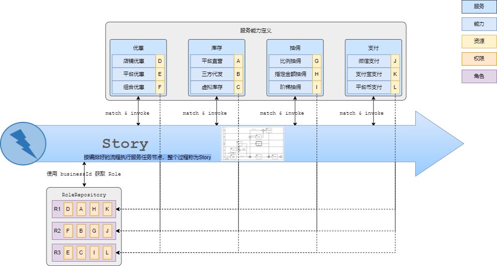

## Kstry能做什么？
**服务编排和可视化**  
> 比如可以通过BPMN软件定义如下流程图和服务任务代码，交给Kstry引擎，便可按编排好的规则去执行  

 

**业务隔离和定制化**  
可以根据业务需要自定义业务角色并给角色赋予权限。业务请求携带角色，匹配满足自身业务特点的服务能力加以执行。  

  

详见：[RBAC模式](./doc/kstry-specification.md#%E4%BA%94rbac%E6%A8%A1%E5%BC%8F) 

**流程回溯**  
流程回溯是在链路执行完之后，拿到结果或者异常之前，打印节点执行日志或执行自定义回调方法，可以应对如下问题： 
- 查看运行过节点的信息、执行顺序、耗时、入参、出参等重要数据 
- 自定义流程回溯日志，甚至是出现异常时才打印回溯日志
- 检查节点执行，参数设置等是否符合预期。有时结果没有报错，并不代表一定是没有问题的
- 如果链路中有自定义角色的操作，检查最终角色是否符合预期

## Kstry适用于哪里？
适用于业务系统、共享平台

## Kstry如何使用？  
- [Kstry 使用文档](./doc/kstry-specification.md) 
- [Kstry 使用demo](https://gitee.com/kstry/kstry-demo) 
