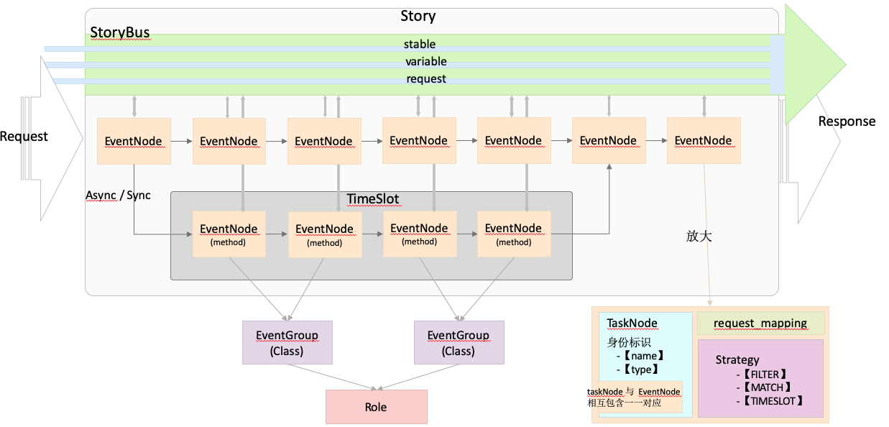
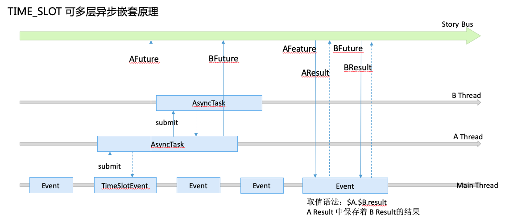

>  [Kstry 使用](./use_kstry.md)

## 一、Kstry架构图

## 二、组件介绍

### 2.1 Kstry 名字由来

​	全称 kiss try。寓意 node 与 node 之间的接触关联，可以像亲吻一样让彼此随意、简单、兴奋。try 说明相邻的彼此并不一定会执行，会路由（match）、会判断是否需要跳过（filter）。又名“流氓框架”（kiss不被允许就是流氓了）

### 2.2 TASK

- 任务，负责处理真正的业务请求，由 TaskNode 定义并执行
- TaskNode（任务节点）派生自 EventNode（事件节点），两者一对一相互关联
- Event 是静态的，是对某个事件的抽象与定义，Task 是动态的，是基于运行态存在的
- Event 静态编排，列举出所有的可能性（PS：A事件被定义了，A事件可以发生的条件是什么，A事件之后后续可能发生的事件又是什么，A事件与B事件必须有先后关系，还是可以异步同时执行）
- Task 是动态路由，通过现存已成结果的事实（入参或者之前节点执行后上报到StoryBus中的结果）对当下 Task 进行路由，判断当下 Task 是否需要执行，之后后续的唯一一个 Task 是哪个，是否可以异步化执行
- 容器初始，会加载所有的 Event，并将 Event 串联成图，形成一张全局事件图

### 2.3 TIME_SLOT

- 时间段标志，Event 虽然是耗时的，但是以全局的视角来看 Event 的耗时并不那么重要了（就好比地铁上贴的全城地铁线路图点与点的距离之于实际地铁的站点之间的距离一样）
- Event 可以看成一个点，而 TIME_SLOT 就是事件的点连成的线。TIME_SLOT 可以由一个 Event 生成，也可由多个 Event 关联而成
- TIME_SLOT 好比子 Story，是这个故事发生期间的一个时间段
- TIME_SLOT 可以同步，也可以异步，同步中可以嵌套异步，异步中也可以进一步嵌套异步

### 2.4 STORY

- 一个用户故事，与用户的一次请求相对应。由 EventNode 和 TIME_SLOT 组成

### 2.5 STORY_BUS

- STORY_BUS 是基于 STORY 存在的，一个 STORY 有一个或者多个 STORY_BUS。（多个 STORY_BUS 出现在 TIME_SLOT 是异步的情况）
- STORY_BUS 定义三大数据域，这些数据域可以在 Story 开始前指定初始值，也会因为 Story 中 Event 的发生对其产生变化：
  - var (Variable): 【 可变 】， 指定后还可变更数据集合，可进行数据覆盖。获取值方式：@var.user
  - sta（Stable）：【 稳定 】，一经指定就不可变数据集合，如果再次指定会打印警告信息，并且当次设置失败，继续保留原值 获取值方式 ：@sta.user
  - req（Request）：【 不可变 】，请求入参集合 （不可变集合，Story 开始前指定，一经指定再也不会发生变化） 获取值方式：@req.user
- 异步流程中 三大数据域的变化（多线程数据安全原理）：
  - var (Variable): 从当前事件流，开启下一个同步事件流时数据共享。开启下一个异步事件流时，将当前事件流当下的值复制给异步事件流（如果索引是对象，还是指向同一个对象）异步流程结束后会建立一个基于 TIME_SLOT 的节点保存异步流程发生的数据。与主流程进行数据隔离。 获取值方式 PS：`$login_event_node.@var.user`
  - sta（Stable）：从当前事件流，开启下一个同步事件流时数据共享。开启下一个异步事件流时，将当前事件流当下的值复制给异步事件流（如果索引是对象，还是指向同一个对象）异步流程结束后会建立一个基于 TIME_SLOT 的节点保存异步流程发生的数据。与主流程进行数据隔离。 获取值方式 PS：`$login_event_node.@sta.user`
  - req（Request）：从当前事件流，无论开启同步还是异步事件流，永远都是一套共享数据

### 2.6 ROLE

- TIME_SLOT 是 Event 在 Story 中的概念，代表是这些 Event 组成了这个 Story，ROLE 是 Event 另一个维度的分组概念
- 一个角色拥有自己的 Event 能力。并且这些能力往往不止一个。就比如 厨师可以做很多种菜，做每一种菜都是一个 Event，那么厨师这个 ROLE 下，就有很多的 Event

### 2.7 EVENT_GROUP

- 事件组，厨师可以做很多菜，但是做菜也有做凉菜、热菜之分。EVENT_GROUP 就是在 ROLE 维度下对 Event 更小力度的分组概念
- 一个 ROLE 下可以有不止一个的 Event 也可以有不止一个的 EVENT_GROUP，一个 EVENT_GROUP 可以有不止一个的 Event 。一个 Event 或者 EVENT_GROUP 必须隶属于一个 ROLE

## 三、原理介绍

## 四、Kstry 特点

- 将主方法处理的逻辑定义成了由一个个Event组装而成的Story，Event的更换、扩展、变更更加方便
- 提出 Role、EventGroup、Event 的逻辑分离概念来界定限界上下文，重要的是这一分层概念必须坚决执行，在Coding时促使开发同学不得不去思考逻辑的归属问题（当然硬要写在一个类里面或者一个方法里面谁也没办法）
- 不仅可以很方便让主流程与可异步的流程分离，而且使用异步极其廉价。还可以支持异步的嵌套
- Event支持判断当前事件是否需要执行的filter，也支持后续执行节点动态路由的match策略，这些策略提供了常用的功能集，不够时还支持自定义
- 引入StoryBus的概念，保存Event产生的事件结果，提供了Event之间数据交互的媒介，并且对结果集进行了分类支持可变、不可变、节点事件结果。让不同业务特性的数据保存在不同的位置
- Event 可以方便组装编排。以此作为基础，后续一定会支持可视化的流程节点编排，与容器启动时路由策略及节点的动态变更。力争展现出一副产品同学也能轻易看懂的业务定义流程图。并且很多需求开放给产品来变更上线

## 五、Kstry 应用

### 5.1 Kstry 可以轻易应用到中台

### 5.2 Kstry 可以使重构可控

- 创建代理层，实现与待重构方法一样的接口，用代理层方法替换掉原方法，代理层引入Kstry
- Kstry 中可以先定义一个Event，Event调用原来需要重构的方法，至此，原方法被Kstry容器接管
- 先易后难，先两边后中间，开始梳理旧方法中的逻辑，将部分可分离的逻辑分类指定到具体的EventGroup、Role下。增加Event实现这些抽离的逻辑并再次加载到Story中
- 循序渐进，没必要一次性重构完，梳理一点拆分一点，新需求来时使用新的Event来满足，这样就将技术改造和业务实现实现了并行，新业务可以穿插在重构中进行