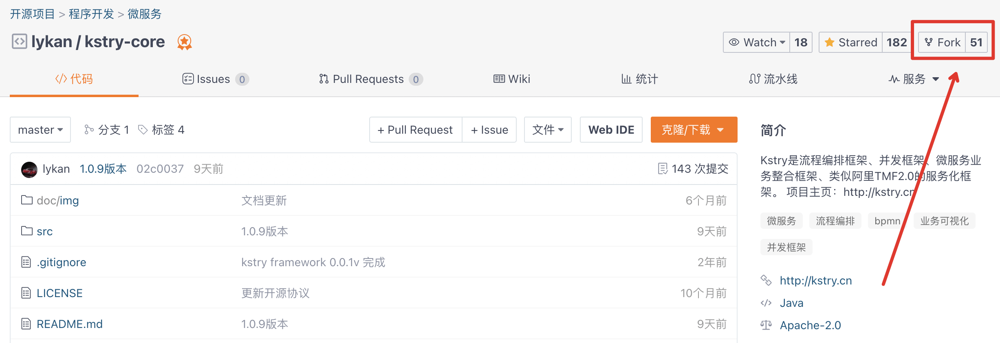
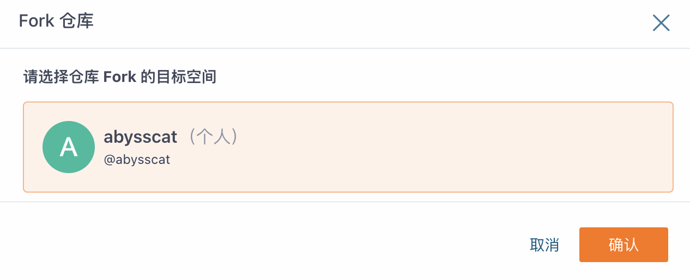
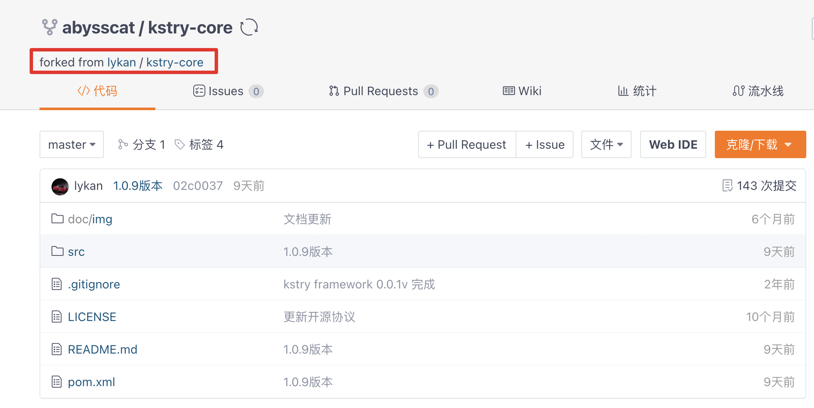
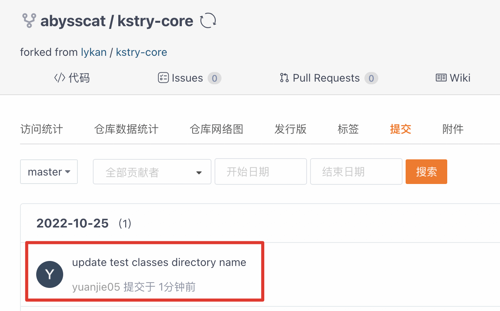
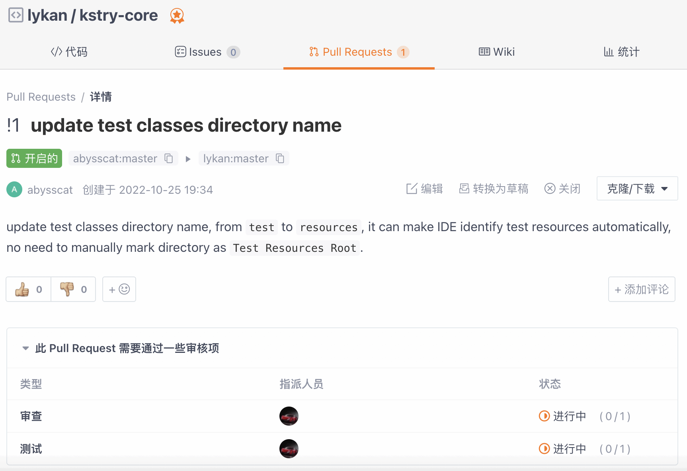
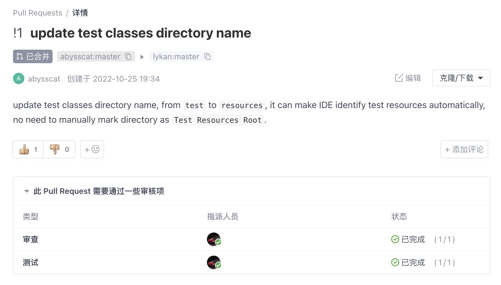
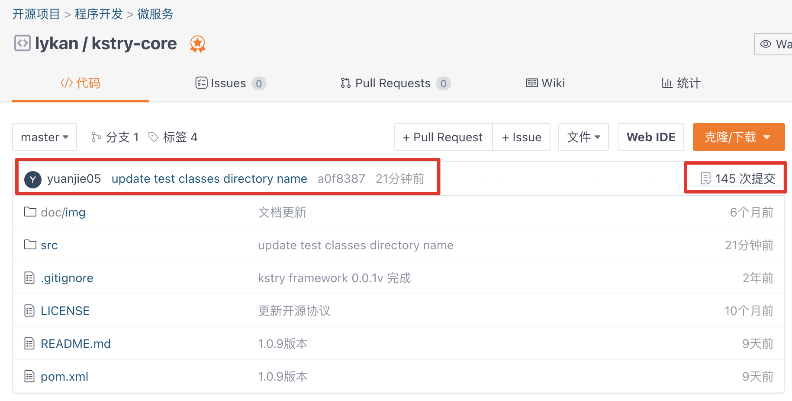
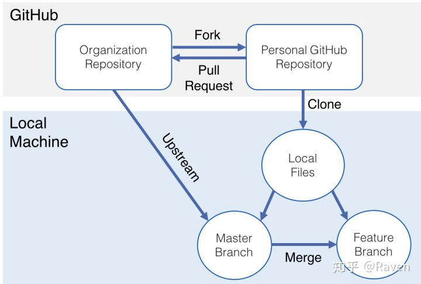
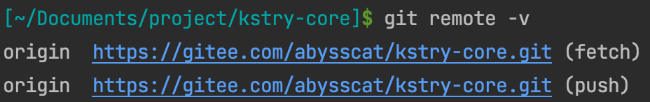
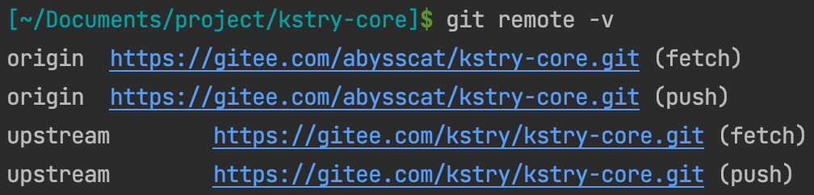

# 我想为Kstry提交代码
### **1、先fork原项目到自己的仓库**





### **2、clone下载fork项目到本地**
``` shell
git clone https://gitee.com/abysscat/kstry-core.git
```

### **3、本地完成代码修改，提交到远程仓库**
``` shell
git add .
git commit -m "update test classes directory name"
git push
```

完成后即可看到：



注：上面是在master分支完成代码提交，比较快捷。如果是针对issue发起pr，可以在fork项目中新建分支名：issue_编号，如issue_178，然后commit描述中将issue编号带上，规范格式，类似：
``` shell
[ISSUE #178] update test classes directory name
```

### **4、发起 Pull Request**




### **5、等待管理员审核**

也可主动在kstry交流群联系管理员。审核通过后，即可看到pr已合入：




即可在项目首页看到自己成为了kstry项目的contributor啦~ 一起加油冲！

github流程和gitee基本一致，按找个步骤即可完成pr。

### **6、后续：如何将原项目更新同步到fork项目**

我们经常会通过上面的方式fork开源项目在自己的仓库中更新，然后提交 Pull Request 为开源项目做贡献。
不过我们经常会遇到原仓库更新，重新 fork 显然是不优雅的，那我们该怎么同步更新呢？基本流程可以参考下图：



- `Organization Repository`：指的是原项目，此处也就是lykan / kstry-core
- `Personal GitHub Repository`：指的是fork后的复制项目，此处是abysscat / kstry-core
- `Local Machine`：指的是本地机器或IDE环境
- `Local Files`：指的是clone到本地的fork项目仓库
- `Master Branch`：指的是本次仓库的master分支，往往需要将远程原项目的改动同步到本地master分支
- `Feature Branch`：指的是本次改动新增的特性分支，该分支需要同步master后，将新的改动commit push到远程fork仓库，提交pr

具体流程如下：

**1. 验证远程分支可以 fetch 或 push**
``` shell
git remote -v
```



**2. 指明我们需要同步的远程仓库**

``` shell
git remote add upstream https://gitee.com/kstry/kstry-core.git
```
注：此处【upstream】其实可以随意指定名称，惯例是 upstream

**3. 验证**

``` shell
git remote -v
```



**4. 拉取合并远程改动**

``` shell
git pull --rebase upstream master
```

其中 `pull = fetch + merge`，一般来说 `git merge` 操作合并分支会让两个分支的每一次提交都按照提交时间（并不是push时间）排序，并且会将两个分支的最新一次commit点进行合并成一个新的commit，最终的分支树呈现非整条线性直线的形式。
此处执行`git pull --rebase upstream master`，则会把`upstream/master`远程的提交拉到本地，然后将本地新的多个提交合成一个新的commit，放到`upstream/master
`最新提交点的后面，保证log的线性整洁。

`git rebase` 操作实际上是将当前执行rebase分支的所有基于原分支提交点之后的commit打散成一个一个的patch，并重新生成一个新的commit
hash值，再次基于原分支目前最新的commit点上进行提交，并不根据两个分支上实际的每次提交的时间点排序，rebase完成后，切到基分支进行合并另一个分支时也不会生成一个新的commit点，可以保持整个分支树的完美线性。

**5. 提交**

``` shell
git push origin master
```

<br />

> 其他具体开源细节可以通过《开源指北》了解：[开源指北](https://gitee.com/gitee-community/opensource-guide)
