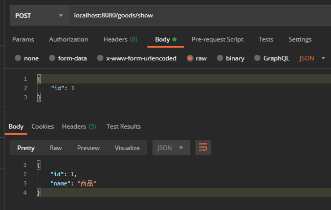
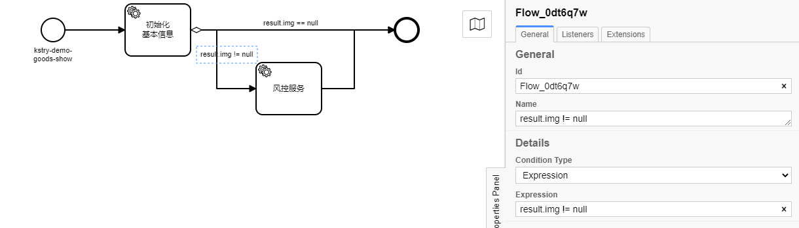
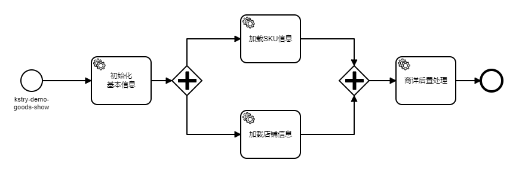
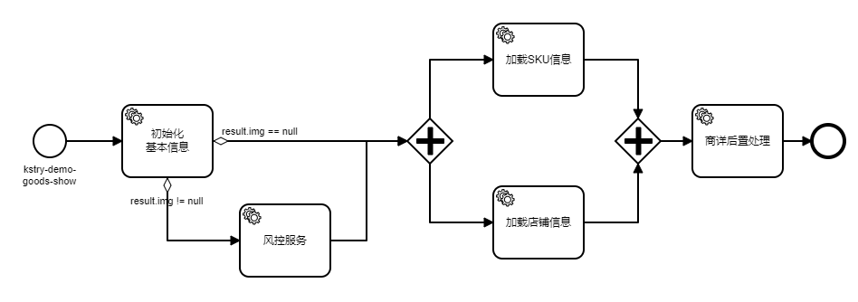
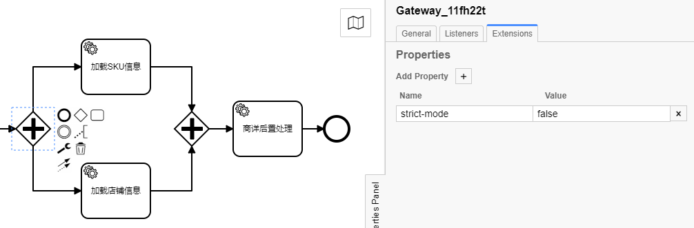
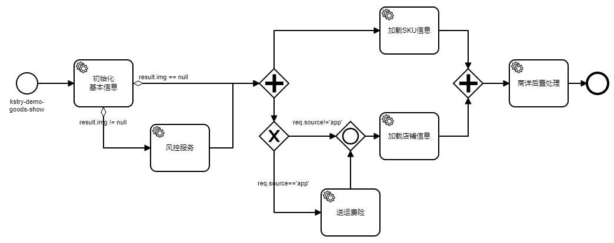
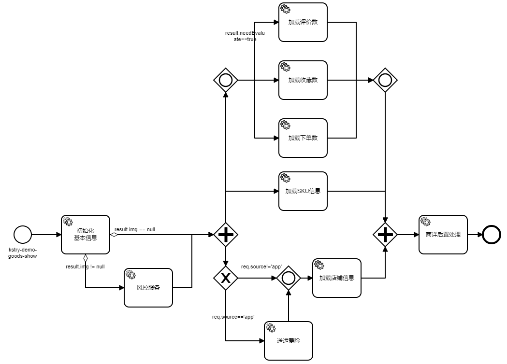
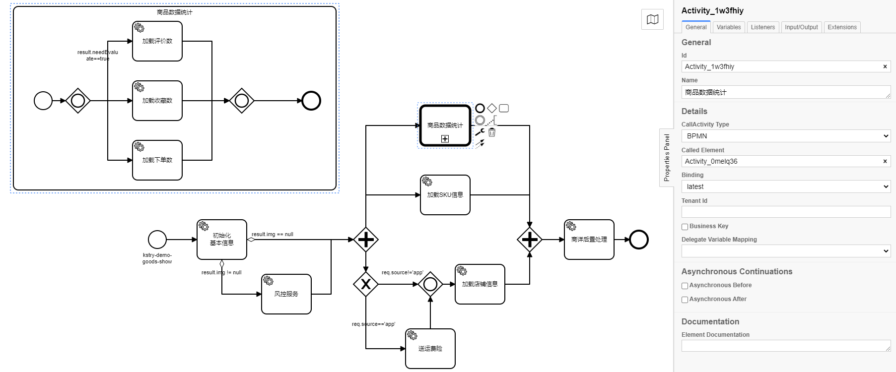
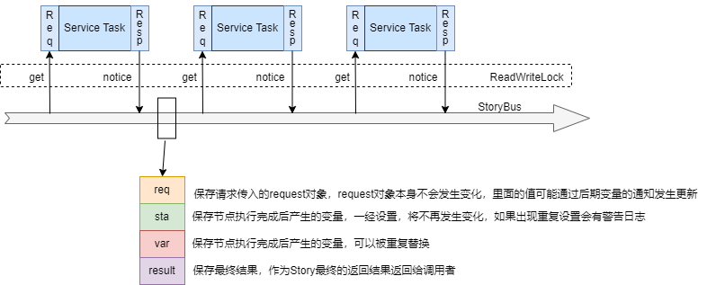

# 一、快速开始

## 1.1 配置引入

``` xml
<dependency>
    <groupId>cn.kstry.framework</groupId>
    <artifactId>kstry-core</artifactId>
    <version>1.0.2-SNAPSHOT</version>
</dependency>
```

## 1.2 项目引入

### 1.2.1 开启Kstry容器

> kstry框架与spring容器有较为密切的关联和依赖，当前版本暂时只能在spring环境中运行

``` java
@EnableKstry(bpmnPath = "./bpmn/*.bpmn")
@SpringBootApplication
public class KstryDemoApplication {

    public static void main(String[] args) {
        SpringApplication.run(KstryDemoApplication.class, args);
    }
}
```

### 1.2.2 编写组件代码

- `@EnableKstry` 代表启动 Kstry 容器
  - bpmnPath： 指定bpmn文件位置

``` java
@TaskComponent(name = GoodsCompKey.goods)
public class GoodsService {

    @TaskService(name = GoodsCompKey.GOODS.initBaseInfo, noticeScope = {ScopeTypeEnum.RESULT})
    public GoodsDetail initBaseInfo(@ReqTaskParam(reqSelf = true) GoodsDetailRequest request) {
        return GoodsDetail.builder().id(request.getId()).name("商品").build();
    }
}
```

> ``` java
> public interface GoodsCompKey {
> 
>     String goods = "goods";
> 
>     interface GOODS {
>         String initBaseInfo = "init-base-info";
>     }
> }
> ```

`@TaskComponent` 作用：

- 起到 Spring 容器 `@Component` 注解作用，将组件托管至 Spring 容器中

- 指定该类是 Kstry 定义 Task 的组件
  - name 指定组件名称，与 bpmn 流程配置文件中 `task-component` 属性进行匹配对应

 `@TaskService` 作用：

- 指定该方法是 Kstry 容器中的 TaskService 节点，也是最小的可编排的执行单元，对应于 bpmn 配置文件中的 `bpmn:serviceTask` 节点

- 该注解只有标注在 Kstry 组件的类方法上，否则将不被解析

  - name 指定该 service node 的名称，与 bpmn 配置文件中的 `task-service` 属性进行匹配对应

  - noticeScope 指定执行结果将被通知到 StoryBus 中的哪些作用域中，`ScopeTypeEnum.RESULT` 说明，该方法执行结果将作为 Story 执行的最终返回结果

- `@ReqTaskParam` 标注在 TaskService 的 params 某个参数上，用来从 StoryBus 的 req 域获取变量值，直接赋值给该参数
  - reqSelf 只有从 req 域获取参数时才有这个属性，代表将客户端传入的request对象直接赋值给被标注的参数

### 1.2.3 定义bpmn配置文件

``` xml
<?xml version="1.0" encoding="UTF-8"?>
<bpmn:definitions xmlns:bpmn="http://www.omg.org/spec/BPMN/20100524/MODEL">
  <bpmn:process id="Process_0zcsieh" isExecutable="true">
    <bpmn:startEvent id="kstry-demo-goods-show" name="kstry-demo-goods-show">
      <bpmn:outgoing>Flow_1w64322</bpmn:outgoing>
    </bpmn:startEvent>
    <bpmn:serviceTask id="Activity_04a99ll" name="show goods">
      <bpmn:extensionElements>
        <camunda:properties>
          <camunda:property name="task-component" value="goods" />
          <camunda:property name="task-service" value="init-base-info" />
        </camunda:properties>
      </bpmn:extensionElements>
      <bpmn:incoming>Flow_1w64322</bpmn:incoming>
      <bpmn:outgoing>Flow_0f9ephk</bpmn:outgoing>
    </bpmn:serviceTask>
    <bpmn:sequenceFlow id="Flow_1w64322" sourceRef="kstry-demo-goods-show" targetRef="Activity_04a99ll" />
    <bpmn:endEvent id="Event_1jdtnd8">
      <bpmn:incoming>Flow_0f9ephk</bpmn:incoming>
    </bpmn:endEvent>
    <bpmn:sequenceFlow id="Flow_0f9ephk" sourceRef="Activity_04a99ll" targetRef="Event_1jdtnd8" />
  </bpmn:process>
</bpmn:definitions>
```

   

- `bpmn:startEvent` 中的 id属性，指定 Story的执行ID，**全局唯一**
  - id 需要符合一定格式的前缀, 默认是：`story-def-`，可通过配置文件进行修改，如下

``` yaml
# application.yml
spring:
  application:
    name: kstry-demo

kstry:
  story:
    prefix: kstry-demo- # 指定 Story 的 StartId 前缀
```

### 1.2.4 执行Story

``` java
@RestController
@RequestMapping("/goods")
public class GoodsController {

    @Resource
    private StoryEngine storyEngine;

    @PostMapping("/show")
    public GoodsDetail showGoods(@RequestBody GoodsDetailRequest request) {

        StoryRequest<GoodsDetail> req = ReqBuilder.returnType(GoodsDetail.class).startId(StartIdEnum.GOODS_SHOW.getId()).request(request).build();
        TaskResponse<GoodsDetail> fire = storyEngine.fire(req);
        if (fire.isSuccess()) {
            return fire.getResult();
        }
        return null;
    }
}
```

> ``` java
> public enum StartIdEnum {
> 
>     GOODS_SHOW("goods-show");
> 
>     StartIdEnum(String id) {
>         this.id = "kstry-demo-" + id;
>     }
> 
>     @Getter
>     private final String id;
> }
> ```

- 从 Spring 容器中注入 StoryEngine 执行器

- ReqBuilder 构建执行入参，传入 startId，request。调用 fire，获取最终结果

## 1.3 测试

 

# 二、流程编排

## 2.1 节点多支路

> 在上传商品图片时，一般会经过风控系统，对所传图片进行筛查，防止有违规图片暴露给用户。暂且忽略性能问题，可以将风控做在商品获取链路中

   

新增图片筛查节点：

``` java
@Slf4j
@TaskComponent(name = RiskControlCompKey.riskControl)
public class RiskControlService {

    @TaskService(name = RiskControlCompKey.checkImg)
    public void checkImg(CheckInfo checkInfo) {

        AssertUtil.notNull(checkInfo);
        AssertUtil.notBlank(checkInfo.getImg());
        log.info("check img: " + checkInfo.getImg());
    }
}
```

- 流程表示：商品信息初始化完成之后，如果商品有图片信息，则进行风控筛查，如果没有直接返回结果

- 节点间的箭头线可以定义执行条件，格式如上图，`result.img != null` 代表 StoryBus 中的 result 不为空，且result的img属性不为null

- Kstry引擎中条件表达式解析器有三个，boolean解析器、角色解析器、Spel解析器
  - 如果是直接输入boolean值，比如 true、y、no等会被认定为boolean值，使用 boolean 解析器解析判断
  - 如果符合权限定义的格式，使用角色解析器解析判断，后面讲到角色权限时会再详细介绍
  - 前两者都不符合时则使用Spel解析器，解析引擎是Spring的Spel解析器，执行格式不对时会报错。返回结果一定是Boolean值。比如上面 `result.img != null`如果result为null时，会抛异常结束

- 事件、网关、任务节点都可以从当前节点引出多个支路，但是**只有并行网关、包含网关、结束事件可以接收归并多个支路**，其他节点有多个入度时会出现配置文件解析失败的情况

- **一个链路图中有且仅有一个开始事件和结束事件**（子事件中同样有这个限制，外围事件和子链路中的事件是可以共同存在的）。

## 2.2 并行网关

> 加载商品基础信息之后，假设需要再加载SKU信息、店铺信息，两个加载过程可以并行进行。加载完所有信息之后再对商详信息进行后置处理，流程如图：

 

新增SKU初始化任务、商详后置处理任务、店铺加载任务：

```java
// 初始化 sku信息，GoodsService.java
@TaskService(name = GoodsCompKey.initSku)
public InitSkuResponse initSku(@ReqTaskParam("id") Long goodsId) {
    SkuInfo sku1 = new SkuInfo();
    sku1.set...

    SkuInfo sku2 = new SkuInfo();
    sku2.set...
    return InitSkuResponse.builder().skuInfos(Lists.newArrayList(sku1, sku2)).build();
}

// 商详信息后置处理，GoodsService.java
@TaskService(name = GoodsCompKey.detailPostProcess)
public void detailPostProcess(DetailPostProcessRequest request) {

    GoodsDetail goodsDetail = request.getGoodsDetail();
    ShopInfo shopInfo = request.getShopInfo();
    if (shopInfo != null) {
        goodsDetail.setShopInfo(shopInfo);
    }
}

// 加载店铺信息，ShopService.java
@TaskService(name = ShopCompKey.getShopInfoByGoodsId)
public ShopInfo getShopInfoByGoodsId(@ReqTaskParam("id") Long goodsId) throws InterruptedException {
    TimeUnit.MILLISECONDS.sleep(200L);
    return goodsIdShopInfoMapping.get(goodsId);
}
```

- 并行网关一般分为两部分，前面将一个分支拆解成多个，后面将多个分支进行聚合。并行网关要求，所有入度全部执行完才能向下执行
- 并行网关支持开启异步流程。未开启多线程模式时，并行网关拆分出的多个分支还是一个线程逐一执行，开启多线程模式后，几个分支将逐一创建异步任务提交到线程池中执行
- 并行网关后面的支路判断条件会被忽略，无论设置与否都不会解析，都会默认为true
- `getShopInfoByGoodsId` 中线程 sleep 了 200ms 模拟耗时较长的任务，**并行网关中，只有全部任务都执行完成之后才会继续向下执行**

将风控组件加到流程之后，得到流程图如下：

 

- 这时再次执行这个Story会报错，报错信息： `[K1040008] A process branch that cannot reach the ParallelGateway appears! sequenceFlowId: Flow_0attv25`

- 报错信息提示存在不能到达并行网关的分支。原因是商品图片只有出现和不出现两种情况，所以两条链路只能执行一条分支，而并行网关要求的是所有入度分支都进入时才能继续执行。解决这个问题有两种方式：

  - 将前一个并行网关改为包含网关，包含网关不要求所有入度分支必须被执行

  - 如图关闭并行网关的严格模式：`strict-mode=false`，关闭严格模式的并行网关，不在限制入度必须被执行。关闭严格模式的并行网关与包含网关并非完全等价的。因为并行网关后面支路的判断条件是被忽略的，但是包含网关后面支路的判断条件是会被解析执行起到决策作用的

  

## 2.3 排他网关

> 假设为了推广公司app，产品承诺会对app下单用户免费赠送运费险，其他平台没有此优惠

 

新增运费险任务：

``` java
@Slf4j
@TaskComponent(name = LogisticCompKey.logistic)
public class LogisticService {

    @TaskService(name = LogisticCompKey.getLogisticInsurance, noticeScope = ScopeTypeEnum.STABLE)
    public LogisticInsurance getLogisticInsurance(GetLogisticInsuranceRequest request) {
        log.info("request source：{}", request.getSource());
        LogisticInsurance logisticInsurance = new LogisticInsurance();
        logisticInsurance.setDesc("运费险描述");
        logisticInsurance.setType(1);
        return logisticInsurance;
    }
}
```

- 为什么要多加一个包含网关呢？是因为之前有提到过：**只有并行网关、包含网关、结束事件可以接收归并多个支路**，其他节点只能接收一个入度，“送运费险”节点不能直接到“加载店铺信息”节点，因为后者已经有了一个入度，所以增加一个包含网关将多个分支进行合拢
- 排他网关入度只能有一个，出度可以多个。出度上面的条件表达式会被解析执行，如果没有条件表达式时会默认是true
- 排他网关多个出度上面表达式被解析成true时，会选择第一个true的继续向下执行，其他的将会被中断。第一个出度与图上的位置没有任何关系，也不能显示控制哪一个出度会被首先执行。所以**如果多个出度都为true时运行结果是不确定的**，应尽量避免这种事情发生
- 当全部出度上的表达式都解析为false时会抛出异常结束流程，异常信息`：[K1040008] Match to the next process node as empty! taskId: Gateway_15malyv`
- 由于排他网关最终执行的只有一条链路，所以排他网关是不支持开启异步的

## 2.4 包含网关

> 假设商品描述中有一些统计信息，比如收藏数、评价数、下单数等，不同的数据统计维护在不同的系统模块中，在商品加载时这些参数需要被加载。但是也并非全部商品都需要加载全部的统计数，比如未开启评价的商品就不需要获取评价数

 

加载商品基础信息时，加上可以评价的属性：

``` java
@TaskService(name = GoodsCompKey.initBaseInfo, noticeScope = {ScopeTypeEnum.RESULT})
public GoodsDetail initBaseInfo(@ReqTaskParam(reqSelf = true) GoodsDetailRequest request) {
    return GoodsDetail.builder().id(request.getId()).name("商品").img("https://xxx.png").needEvaluate(true).build();
}
```

新增订单信息获取、评价信息获取、商品扩展信息获取

``` java
@TaskComponent(name = "order")
public class OrderService {

    @TaskService(name = "get-order-info", noticeScope = ScopeTypeEnum.STABLE)
    public OrderInfo getOrderInfo(@ReqTaskParam("id") Long goodsId) {
        OrderInfo orderInfo = new OrderInfo();
        orderInfo.setOrderedCount(10);
        log.info("goods id: {}, get OrderInfo: {}", goodsId, JSON.toJSONString(orderInfo));
        return orderInfo;
    }
}

@TaskComponent(name = "evaluation")
public class EvaluationService {

    @TaskService(name = "get-evaluation-info", noticeScope = ScopeTypeEnum.STABLE)
    public EvaluationInfo getEvaluationInfo(@ReqTaskParam("id") Long goodsId) {
        EvaluationInfo evaluationInfo = new EvaluationInfo();
        evaluationInfo.setEvaluateCount(20);
        log.info("goods id: {}, get EvaluationInfo: {}", goodsId, JSON.toJSONString(evaluationInfo));
        return evaluationInfo;
    }
}

@TaskService(name = "get-goods-ext-info", noticeScope = ScopeTypeEnum.STABLE)
public GoodsExtInfo getGoodsExtInfo(@ReqTaskParam("id") Long goodsId) {
    GoodsExtInfo goodsExtInfo = new GoodsExtInfo();
    goodsExtInfo.setCollectCount(30);
    log.info("goods id: {}, get GoodsExtInfo: {}", goodsId, JSON.toJSONString(goodsExtInfo));
    return goodsExtInfo;
}
```

最终商品信息后置处理时将统计信息汇总：

``` java
@TaskService(name = GoodsCompKey.detailPostProcess)
public void detailPostProcess(DetailPostProcessRequest request) {
    GoodsDetail goodsDetail = request.getGoodsDetail();
	...
    GoodsExtInfo goodsExtInfo = request.getGoodsExtInfo();
    OrderInfo orderInfo = request.getOrderInfo();
    EvaluationInfo evaluationInfo = request.getEvaluationInfo();
    goodsDetail.setStatistics(Lists.newArrayList(goodsExtInfo.getCollectCount(), orderInfo.getOrderedCount(), evaluationInfo.getEvaluateCount()));
}
```

- 包含网关与并行网关一样，支持开启异步流程，支持接收多个入度
- 包含网关没有所有入度必须被执行的限制，等待全部入度执行完成或者得知其中可能有部分入度不满足条件不再执行后，会继续向下执行
- 包含网关后面出度可以设置表达式，表达式解析规则与排他网关出度解析规则一样

## 2.5 子流程

> 上面可以看到，数据统计不仅仅在商详展示时会用到，商品列表可能会用到，订单展示也可能会用到，所以统计逻辑是一个可以复用的模块，可以将其抽离进行单独升级进化

  

``` xml
<?xml version="1.0" encoding="UTF-8"?>
<bpmn:definitions xmlns:bpmn="http://www.omg.org/spec/BPMN/20100524/MODEL">
  <bpmn:process id="Process_0zcsieh" isExecutable="true">
    <bpmn:subProcess id="Activity_0melq36" name="商品数据统计">
      <bpmn:startEvent id="Event_1h3q9xl">
        <bpmn:outgoing>Flow_0hyd05a</bpmn:outgoing>
      </bpmn:startEvent>
      ...
      <bpmn:endEvent id="Event_10avvlg">
        <bpmn:incoming>Flow_1ylaoip</bpmn:incoming>
      </bpmn:endEvent>
      <bpmn:sequenceFlow id="Flow_1ylaoip" sourceRef="Gateway_0ay4c64" targetRef="Event_10avvlg" />
    </bpmn:subProcess>
    <bpmn:callActivity id="Activity_1w3fhiy" name="商品数据统计" calledElement="Activity_0melq36">
      <bpmn:incoming>Flow_0hbi1mg</bpmn:incoming>
      <bpmn:outgoing>Flow_0lmq6ak</bpmn:outgoing>
    </bpmn:callActivity>
  </bpmn:process>
</bpmn:definitions>
```

- 定义`bpmn:process` 将需要分离的子流程包含在内
- 子流程有独立于父流程之外独立的开始事件、结束时间
- 子流程是支持嵌套的，A子流程可以依赖B子流程，但是自身依赖自身是非法的。并且子流程中支持开启并发模式
- 定义`bpmn:callActivity`将定义的子流程引入，程序运行到此时会跳转至子流程执行，子流程执行完成后会跳转回来继续执行

# 三、数据流转

> 前面演示了节点、网关、事件如何通过合适的编排来应对业务不断变化带来的挑战。编排好的Story中节点与节点之间并非是完全独立的，风控检查的是商品基础信息的图片，通过入参的来源来判断是否赠送运费险，商品信息的后置处理将前面加载的一系列信息进行统一装配，等等节点间的关联无处不在。承载节点间通信工作的最重要角色就是 **StoryBus** 组件

## 3.1 StoryBus介绍

  

- 每一个任务节点如果有需要，都可以从 StoryBus 中获取需要的参数，执行完之后，将需要的结果通知到 StoryBus
- StoryBus 中有四个数据域，分别是：
  - **req**：保存请求传入的request对象，request对象本身不会发生变化。但对象里面的值允许通过后期的变量通知发生更新
  - **sta**：保存节点执行完成后产生的变量，一经设置，将不再发生变化，如果出现重复设置会有警告日志（如果只有对象引用是sta域的，对象里面的字段也是可以发生更新的，这点与req相同）
  - **var**：保存节点执行完成后产生的变量，可以被重复替换，对象里面字段性质同上
  - **result**：保存最终结果，作为 Story 执行完成后最终的结果返回给调用者
- 条件表达式可以直接引用这四个域做条件判断，如流程编排中出现的：`result.img != null`、`req.source!='app'`
- 四个作用域被读写锁保护着，get获取读锁，notice获取写锁，防止出现并发问题
- 开启异步模式后，同时创建的子任务都可以读写StoryBus中的变量，所以**数据方面有前后依赖关系的节点，不能被创建到同一时间段执行的不同子任务中**，可以通过聚合节点来保证节点执行的先后顺序

## 3.2 变量注解

###  3.2.1 获取变量

标注在 TaskService 方法入参上，从StoryBus中获取到变量后，直接赋值给参数字段，例如：

``` java
@TaskService(name = "get-evaluation-info", noticeScope = ScopeTypeEnum.STABLE)
public EvaluationInfo getEvaluationInfo(@ReqTaskParam("id") Long goodsId) {
    EvaluationInfo evaluationInfo = new EvaluationInfo();
    evaluationInfo.setEvaluateCount(20);
    log.info("goods id: {}, get EvaluationInfo: {}", goodsId, JSON.toJSONString(evaluationInfo));
    return evaluationInfo;
}
```

- `@TaskParam`：从 StoryBus 的 req、sta、var 域获取变量值，直接赋值给被标注参数
  - `value`：参数字段名字
  - `scopeEnum`：指定是从哪个域获取字段，可取参数：`ScopeTypeEnum.STABLE`、`ScopeTypeEnum.VARIABLE`、`ScopeTypeEnum.REQUEST`
- `@ReqTaskParam`：从 StoryBus 的 req 域获取变量值，直接赋值给被标注参数
  - `value`：参数字段名字
  - `reqSelf`：是否将客户端传入的 request 对象整体赋值给该参数，默认为：false
- `@StaTaskParam`：从 StoryBus 的 sta 域获取变量值，直接赋值给被标注参数
  - `value`：参数字段名字
- `@VarTaskParam`：从 StoryBus 的 var 域获取变量值，直接赋值给被标注参数
  - `value`：参数字段名字


标注在 TaskService 方法入参对象中的字段上，从StoryBus中获取到变量后，直接赋值给被标注字段，例如：

``` java
@TaskComponent(name = LogisticCompKey.logistic)
public class LogisticService {

    @TaskService(name = LogisticCompKey.getLogisticInsurance, noticeScope = ScopeTypeEnum.STABLE)
    public LogisticInsurance getLogisticInsurance(GetLogisticInsuranceRequest request) {
        log.info("request source：{}", request.getSource());
        LogisticInsurance logisticInsurance = new LogisticInsurance();
        logisticInsurance.setDesc("运费险描述");
        logisticInsurance.setType(1);
        return logisticInsurance;
    }
}

@Data
public class GetLogisticInsuranceRequest {

    @ReqTaskField("source")
    private String source;
}
```

- `@TaskField`：从 StoryBus 的 req、sta、var 域获取变量值，赋值给被标注字段
  - `value`：字段名字
  - `scopeEnum`：指定是从哪个域获取字段，可取参数：`ScopeTypeEnum.STABLE`、`ScopeTypeEnum.VARIABLE`、`ScopeTypeEnum.REQUEST`
- `@ReqTaskField`：从 StoryBus 的 req 域获取变量值，赋值给被标注字段
  - `value`：字段名字
- `@StaTaskField`：从 StoryBus 的 sta 域获取变量值，赋值给被标注字段
  - `value`：字段名字
- `@VarTaskField`：从 StoryBus 的 var 域获取变量值，赋值给被标注字段
  - `value`：字段名字


### 3.2.2 通知变量

TaskService 注解中的 `noticeScope` 属性通知，例如：

``` java
@TaskComponent(name = "order")
public class OrderService {

    @TaskService(name = "get-order-info", noticeScope = {ScopeTypeEnum.STABLE, ScopeTypeEnum.VARIABLE})
    public OrderInfo getOrderInfo(@ReqTaskParam("id") Long goodsId) {
        OrderInfo orderInfo = new OrderInfo();
        orderInfo.setOrderedCount(10);
        log.info("goods id: {}, get OrderInfo: {}", goodsId, JSON.toJSONString(orderInfo));
        return orderInfo;
    }
}
```

- `noticeScope` 只能控制将方法返回的结果通知到哪些作用域，与结果对象中的字段没有关系
- `noticeScope` 支持数组类型，有效取值：`ScopeTypeEnum.STABLE`、`ScopeTypeEnum.VARIABLE`、`ScopeTypeEnum.RESULT`
- 方法返回结果被 `noticeScope` 通知后，如果结果类被**相同域**的 @NoticeXX 注解修饰了，类上的注解将失效，以`noticeScope` 为准
- `noticeScope` 只能控制通知域，但是控制不了变量名称。默认情况下是方法返回值类名首字母小写作为变量名称


注解方式向 StoryBus 中通知变量，注解可以标注在结果类上，也可以标注在字段上，例如：

``` java
@NoticeSta(name = GoodsCompKey.InitBaseInfoResponse.goodsDetail)
public class GoodsDetail {

    private Long id;

    private String name;
}

@Data
@Builder
public class InitSkuResponse {

    @NoticeSta(name = GoodsCompKey.InitSkuResponse.noticeSkuInfos)
    private List<SkuInfo> skuInfos;
}
```

- `@NoticeAll`：可以标注在方法返回结果的类上或者类字段上，字段结果被通知到 bus 中的 sta 和 var两个域中
  - `name`：通知到作用域字段的名字

- `@NoticeSta`：可以标注在方法返回结果的类上或者类字段上，字段结果被通知到 bus 中的 sta 域中
  - `name`：通知到作用域字段的名字

- `@NoticeVar`：可以标注在方法返回结果的类上或者类字段上，字段结果被通知到 bus 中的 var 域中
  - `name`：通知到作用域字段的名字

- `@NoticeResult`：可以标注在方法返回结果的类上或者类字段上，字段结果被通知到 bus 中的 result 域中


# 四、异步支持

# 五、RBAC模式

# 六、变量

# 七、链路追踪

