# 一、快速开始

## 1.1 配置引入

``` xml
<dependency>
    <groupId>cn.kstry.framework</groupId>
    <artifactId>kstry-core</artifactId>
    <version>1.0.2-SNAPSHOT</version>
</dependency>
```

## 1.2 项目引入

### 1.2.1 开启Kstry容器

> kstry框架与spring容器有较为密切的关联和依赖，当前版本暂时只能在spring环境中运行

``` java
@EnableKstry(bpmnPath = "./bpmn/*.bpmn")
@SpringBootApplication
public class KstryDemoApplication {

    public static void main(String[] args) {
        SpringApplication.run(KstryDemoApplication.class, args);
    }
}
```

`@EnableKstry` 注解代表了要启动 Kstry 容器

- bpmnPath： 指定bpmn文件位置。Kstry服务任务节点编排，使用的就是bpmn文件

### 1.2.2 编写组件代码

``` java
@TaskComponent(name = "goods")
public class GoodsService {

    @TaskService(name = "init-base-info", noticeScope = {ScopeTypeEnum.RESULT})
    public GoodsDetail initBaseInfo(@ReqTaskParam(reqSelf = true) GoodsDetailRequest request) {
        return GoodsDetail.builder().id(request.getId()).name("商品").build();
    }
}
```

`@TaskComponent` 作用：

- 与 Spring 容器中 `@Component` 注解有着相同的作用，将被标注的类组件托管至 Spring 容器中

- 指定该类成为了 Kstry 容器可解析的任务组件，可在其中定义服务任务节点（被`@TaskService`注解修饰的方法称为**服务任务节点**）
  - `name` ：指定组件名称，与 bpmn 流程配置文件中 `task-component` 属性对应

`@TaskService` 作用：

- 指定该方法是 Kstry 容器中的服务任务节点，也是在bpmn配置文件中可编排的最小执行单元，对应于 bpmn 配置文件中的 `bpmn:serviceTask` 节点
- 该注解只能定义在 Kstry 容器可解析的任务组件类中，否则将不被解析

  - `name` ：指定该服务任务节点的名称，与 bpmn 配置文件中的 `task-service` 属性进行匹配对应

  - `noticeScope` ：指定执行结果将被通知到 StoryBus 中的哪些作用域中，`ScopeTypeEnum.RESULT` 说明，该方法执行结果将被通知到 result 域，最终作为 Story 的执行结果返回给调用方
- `@ReqTaskParam` 标注在服务任务节点的方法参数上，用来从 StoryBus 的 req 域获取变量值，并直接赋值给被标注的参数项
  - `reqSelf` ：只有从 req 域获取参数时才有这个属性，该属性代表将客户端传入的 request 对象直接赋值给被标注的参数项

> StoryBus  是 Story 中的数据总线，负责存取节点产生的结果，后面将详细介绍

### 1.2.3 定义bpmn配置文件

``` xml
<?xml version="1.0" encoding="UTF-8"?>
<bpmn:definitions xmlns:bpmn="http://www.omg.org/spec/BPMN/20100524/MODEL">
  <bpmn:process id="Process_0zcsieh" isExecutable="true">
    <bpmn:startEvent id="kstry-demo-goods-show" name="kstry-demo-goods-show">
      <bpmn:outgoing>Flow_1w64322</bpmn:outgoing>
    </bpmn:startEvent>
    <bpmn:serviceTask id="Activity_04a99ll" name="show goods">
      <bpmn:extensionElements>
        <camunda:properties>
          <camunda:property name="task-component" value="goods" />
          <camunda:property name="task-service" value="init-base-info" />
        </camunda:properties>
      </bpmn:extensionElements>
      <bpmn:incoming>Flow_1w64322</bpmn:incoming>
      <bpmn:outgoing>Flow_0f9ephk</bpmn:outgoing>
    </bpmn:serviceTask>
    <bpmn:sequenceFlow id="Flow_1w64322" sourceRef="kstry-demo-goods-show" targetRef="Activity_04a99ll" />
    <bpmn:endEvent id="Event_1jdtnd8">
      <bpmn:incoming>Flow_0f9ephk</bpmn:incoming>
    </bpmn:endEvent>
    <bpmn:sequenceFlow id="Flow_0f9ephk" sourceRef="Activity_04a99ll" targetRef="Event_1jdtnd8" />
  </bpmn:process>
</bpmn:definitions>
```


- `bpmn:startEvent` 中的 id属性，指定 Story的执行ID，**全局唯一**
  - `id`： 需要符合一定格式的前缀, 默认是：`story-def-`，可通过配置文件进行修改，如下

``` yaml
# application.yml
kstry:
  story:
    prefix: kstry-demo- # 指定 Story 的 StartId 前缀
```

### 1.2.4 执行Story

``` java
@RestController
@RequestMapping("/goods")
public class GoodsController {

    @Resource
    private StoryEngine storyEngine;

    @PostMapping("/show")
    public GoodsDetail showGoods(@RequestBody GoodsDetailRequest request) {

        StoryRequest<GoodsDetail> req = ReqBuilder.returnType(GoodsDetail.class).startId("kstry-demo-goods-show").request(request).build();
        TaskResponse<GoodsDetail> fire = storyEngine.fire(req);
        if (fire.isSuccess()) {
            return fire.getResult();
        }
        return null;
    }
}
```

- 从 Spring 容器中注入 StoryEngine 执行器

- ReqBuilder 构建执行入参，传入 startId，request。调用 fire方法，获取最终结果

## 1.3 测试

 

# 二、流程编排

## 2.1 节点多支路

> **场景假设：**在上传商品图片时，一般会经过风控系统，对所传图片进行审查，以此防止给用户展示了一些违规图片，所带来的不良社会反映。这里暂且忽略性能问题，将风控审查动作做在了商品获取链路中

**BPMN图示如下：**

    

- 加载商品基本信息后，如果有图片则进行图片审查，否则结束流程

**新增“图片筛查”服务任务节点：**

``` java
@Slf4j
@TaskComponent(name = "risk-control")
public class RiskControlService {

    @TaskService(name = "check-img")
    public void checkImg(CheckInfo checkInfo) {

        AssertUtil.notNull(checkInfo);
        AssertUtil.notBlank(checkInfo.getImg());
        log.info("check img: " + checkInfo.getImg());
    }
}
```

- 节点间的箭头线可以定义执行条件，格式如上图，`result.img != null` 代表 StoryBus 中的 result 不为空，且 result 的 img 字段不为null
- Kstry 引擎中条件表达式解析器有三个，boolean解析器、角色鉴权解析器、Spel表达式解析器
  - 如果是直接输入boolean值，比如 true、y、no等会被认定为 boolean 值，使用 boolean 解析器解析判断
  - 如果符合权限定义的格式，使用角色鉴权解析器解析判断，后面讲到角色权限时会再详细介绍
  - 前两者都不符合时则使用Spel表达式解析器，解析引擎是 Spring 的 Spel解析器，表达式格式解析失败时会报错。解析结果一定得是Boolean值。比如上面 `result.img != null`如果 result 为 null 时，会抛异常结束
- 事件（Event）、网关（Gateway）、任务（Task）节点都可以从当前节点引出多个支路（也叫允许有多个出度），但是**只有并行网关、包含网关、结束事件可以接收多个入度**，其他节点有多个入度时会出现配置文件解析失败的报错
- **一个链路图中有且仅有一个开始事件和一个结束事件**（子事件中同样有这个限制，外围事件和子流程中的事件是可以共同存在的）
- 任务（Task）、事件（Event）节点后面的出度如果没有定义表达式时，默认为true。不同类型的网关（Gateway）节点特点不同，后面介绍

## 2.2 并行网关

> **场景假设：**加载商品基础信息之后，假设需要再加载SKU信息、店铺信息。两个加载过程没有前后依赖关系，所以可以并行进行。加载完所有信息之后再对商详信息进行后置处理

**BPMN图示如下：**

 

**新增“加载SKU信息”、“加载店铺信息”、“商详后置处理”三个服务任务节点：**

```java
// 初始化 sku信息，GoodsService.java
@TaskService(name = "init-sku")
public InitSkuResponse initSku(@ReqTaskParam("id") Long goodsId) {
    SkuInfo sku1 = new SkuInfo();
    sku1.set...
    SkuInfo sku2 = new SkuInfo();
    sku2.set...
    return InitSkuResponse.builder().skuInfos(Lists.newArrayList(sku1, sku2)).build();
}

// 商详信息后置处理，GoodsService.java
@TaskService(name = "detail-post-process")
public void detailPostProcess(DetailPostProcessRequest request) {
    GoodsDetail goodsDetail = request.getGoodsDetail();
    ShopInfo shopInfo = request.getShopInfo();
    if (shopInfo != null) {
        goodsDetail.setShopInfo(shopInfo);
    }
}

// 加载店铺信息，ShopService.java
@TaskService(name = "get-shopInfo-goodsId")
public ShopInfo getShopInfoByGoodsId(@ReqTaskParam("id") Long goodsId) throws InterruptedException {
    TimeUnit.MILLISECONDS.sleep(200L);
    return goodsIdShopInfoMapping.get(goodsId);
}
```

> `getShopInfoByGoodsId` 中线程 sleep 了 200ms 模拟耗时较长的任务

- **并行网关要求所有入度全部执行完才能向下继续**，否则将一直等待
- 使用并行网关时，一般会有前后两个并行网关节点一起出现，前面将一个分支拆解成多个，后面将多个分支进行聚合
- 并行网关支持开启异步流程。未开启异步流程时，并行网关拆分出的多个分支还是一个线程逐一执行，开启异步流程后，每个分支都将逐一创建异步任务并提交到线程池中执行
- 并行网关后面的出度如果有表达式，表达式会被忽略，无论设置与否都不会解析，都会默认为true

**将风控组件加到流程之后，得到流程图如下：**

 

- 此时如果再次执行这个 Story 会报错，报错信息： `[K1040008] A process branch that cannot reach the ParallelGateway appears! sequenceFlowId: Flow_0attv25`

- 报错信息提示链路中存在不能到达并行网关的分支。原因是商品图片只有出现和不出现两种情况，所以“初始化基本信息”服务任务节点后面的两条链路只能执行一条，而并行网关要求的是所有入度分支都完成时才能继续执行。解决这个问题有两种方式：

  - 将前一个并行网关改为包含网关，包含网关不要求所有入度分支都必须被执行

  - 如下图，关闭并行网关的严格模式：`strict-mode=false`。关闭严格模式的并行网关，不再限制网关入度必须都被执行。关闭严格模式的并行网关与包含网关也并非是完全等价的。因为并行网关后面出度的条件表达式是被忽略的，但是包含网关后面出度的条件表达式是会被解析执行起到决策作用的

   

## 2.3 排他网关

> **场景假设：**为了推广公司app，产品承诺会对app端下单用户免费赠送运费险，其他平台没有此优惠

**BPMN图示如下：**

 

**新增“送运费险”服务任务节点：**

``` java
@Slf4j
@TaskComponent(name = "logistic")
public class LogisticService {

    @TaskService(name = "get-logistic-insurance", noticeScope = ScopeTypeEnum.STABLE)
    public LogisticInsurance getLogisticInsurance(GetLogisticInsuranceRequest request) {
        log.info("request source：{}", request.getSource());
        LogisticInsurance logisticInsurance = new LogisticInsurance();
        logisticInsurance.setDesc("运费险描述");
        logisticInsurance.setType(1);
        return logisticInsurance;
    }
}
```

- 图示中为什么要多加一个包含网关呢？是因为之前有提到过：**只有并行网关、包含网关、结束事件可以接收归并多个入度**，其他节点只能接收一个入度，“送运费险”节点不能直接到“加载店铺信息”节点，因为后者已经有了一个入度，所以增加一个包含网关将多个分支进行合拢
- 排他网关入度只能有一个，出度可以多个。出度上面的条件表达式会被解析执行，如果没有条件表达式时会默认是true
- 排他网关有多个出度上面表达式被解析成true时，会选择第一个为true的分支继续向下执行，其他的将会被忽略不再执行。图示上出度的前后并不代表程序解析时出度的先后顺序，所以排他网关后面**如果多个出度都为true时运行结果是不确定的**，应尽量避免这种事情发生
- 当全部出度上的表达式都解析为false时会抛出异常并结束流程，异常信息`：[K1040008] Match to the next process node as empty! taskId: Gateway_15malyv`
- 由于排他网关最终执行的只有一条链路，所以排他网关是不支持开启异步的，因为没啥意义

## 2.4 包含网关

> **场景假设：**假设商品描述中有一些统计信息，比如收藏数、评价数、下单数等，不同的数据统计在不同的系统模块中维护，在商品加载时这些统计参数也需要被加载。但也并非是所有商品都需要加载全部的统计参数，比如未开启评价的商品就不需要获取评价数

**BPMN图示如下：**

 

**加载商品基础信息时，加上可以评价的属性：**

``` java
@TaskService(name = "init-base-info", noticeScope = {ScopeTypeEnum.RESULT})
public GoodsDetail initBaseInfo(@ReqTaskParam(reqSelf = true) GoodsDetailRequest request) {
    // needEvaluate(true)
    return GoodsDetail.builder().id(request.getId()).name("商品").img("https://xxx.png").needEvaluate(true).build();
}
```

**新增订单信息获取、评价信息获取、商品扩展信息获取服务任务节点：**

``` java
@TaskComponent(name = "order")
public class OrderService {

    @TaskService(name = "get-order-info", noticeScope = ScopeTypeEnum.STABLE)
    public OrderInfo getOrderInfo(@ReqTaskParam("id") Long goodsId) {
        OrderInfo orderInfo = new OrderInfo();
        orderInfo.setOrderedCount(10);
        log.info("goods id: {}, get OrderInfo: {}", goodsId, JSON.toJSONString(orderInfo));
        return orderInfo;
    }
}

@TaskComponent(name = "evaluation")
public class EvaluationService {

    @TaskService(name = "get-evaluation-info", noticeScope = ScopeTypeEnum.STABLE)
    public EvaluationInfo getEvaluationInfo(@ReqTaskParam("id") Long goodsId) {
        EvaluationInfo evaluationInfo = new EvaluationInfo();
        evaluationInfo.setEvaluateCount(20);
        log.info("goods id: {}, get EvaluationInfo: {}", goodsId, JSON.toJSONString(evaluationInfo));
        return evaluationInfo;
    }
}

@TaskService(name = "get-goods-ext-info", noticeScope = ScopeTypeEnum.STABLE)
public GoodsExtInfo getGoodsExtInfo(@ReqTaskParam("id") Long goodsId) {
    GoodsExtInfo goodsExtInfo = new GoodsExtInfo();
    goodsExtInfo.setCollectCount(30);
    log.info("goods id: {}, get GoodsExtInfo: {}", goodsId, JSON.toJSONString(goodsExtInfo));
    return goodsExtInfo;
}
```

**最终商品信息后置处理时将统计信息汇总：**

``` java
@TaskService(name = GoodsCompKey.detailPostProcess)
public void detailPostProcess(DetailPostProcessRequest request) {
    GoodsDetail goodsDetail = request.getGoodsDetail();
	...
    GoodsExtInfo goodsExtInfo = request.getGoodsExtInfo();
    OrderInfo orderInfo = request.getOrderInfo();
    EvaluationInfo evaluationInfo = request.getEvaluationInfo();
    goodsDetail.setStatistics(Lists.newArrayList(goodsExtInfo.getCollectCount(), orderInfo.getOrderedCount(), evaluationInfo.getEvaluateCount()));
}
```

- 包含网关与并行网关一样，支持开启异步流程，支持接收多个入度
- 包含网关没有所有入度必须被执行的限制，等待全部入度执行完成或者得知其中可能有部分入度不满足条件不再执行后，会继续向下执行
- 包含网关后面出度可以设置条件表达式，表达式解析规则与排他网关出度解析规则相同

## 2.5 子流程

> **场景假设：**上面可以看到，数据统计不仅仅在商详展示时会用到，商品列表可能会用到，订单展示也可能会用到，所以统计逻辑是一个可以复用的模块，可以将其抽离，以便之后进行单独维护升级。这样也使原来比较复杂的流程图得到了简化，理解起来会更加方便

**BPMN图示如下：**

 

**BPMN配置文件：**

``` xml
<?xml version="1.0" encoding="UTF-8"?>
<bpmn:definitions xmlns:bpmn="http://www.omg.org/spec/BPMN/20100524/MODEL">
  <bpmn:process id="Process_0zcsieh" isExecutable="true">
    <!-- 定义子流程 -->
    <bpmn:subProcess id="Activity_0melq36" name="商品数据统计">
      <bpmn:startEvent id="Event_1h3q9xl">
        <bpmn:outgoing>Flow_0hyd05a</bpmn:outgoing>
      </bpmn:startEvent>
      ...
      <bpmn:endEvent id="Event_10avvlg">
        <bpmn:incoming>Flow_1ylaoip</bpmn:incoming>
      </bpmn:endEvent>
      <bpmn:sequenceFlow id="Flow_1ylaoip" sourceRef="Gateway_0ay4c64" targetRef="Event_10avvlg" />
    </bpmn:subProcess>
    <!-- 引用子流程 -->
    <bpmn:callActivity id="Activity_1w3fhiy" name="商品数据统计" calledElement="Activity_0melq36">
      <bpmn:incoming>Flow_0hbi1mg</bpmn:incoming>
      <bpmn:outgoing>Flow_0lmq6ak</bpmn:outgoing>
    </bpmn:callActivity>
  </bpmn:process>
</bpmn:definitions>
```

- 定义`bpmn:process` 将需要分离的子流程包含在内
- 子流程有独立于父流程之外的开始事件、结束事件
- 子流程是支持嵌套的，A子流程可以依赖B子流程，但是自身依赖自身是非法的。并且子流程中也支持开启异步模式
- 定义`bpmn:callActivity`引用子流程，程序运行到此时会跳转至子流程执行，子流程执行完成后会跳转回来继续执行

## 2.6 节点控制

### 2.6.1 允许服务为空

> **场景假设：**假设商品渲染时需要加载一些外部的商业广告，这时我们就要升级流程图增加获取广告信息的部分。但是这个流程图又在被多个系统解析执行，一部分系统有加载广告的模块，但有的系统不具备这个能力。这时如果不具备加载广告服务节点的系统解析该流程图时就会报错，原因是代码中找不到与配置文件中节点定义相匹配的服务任务节点

**BPMN图示如下：**

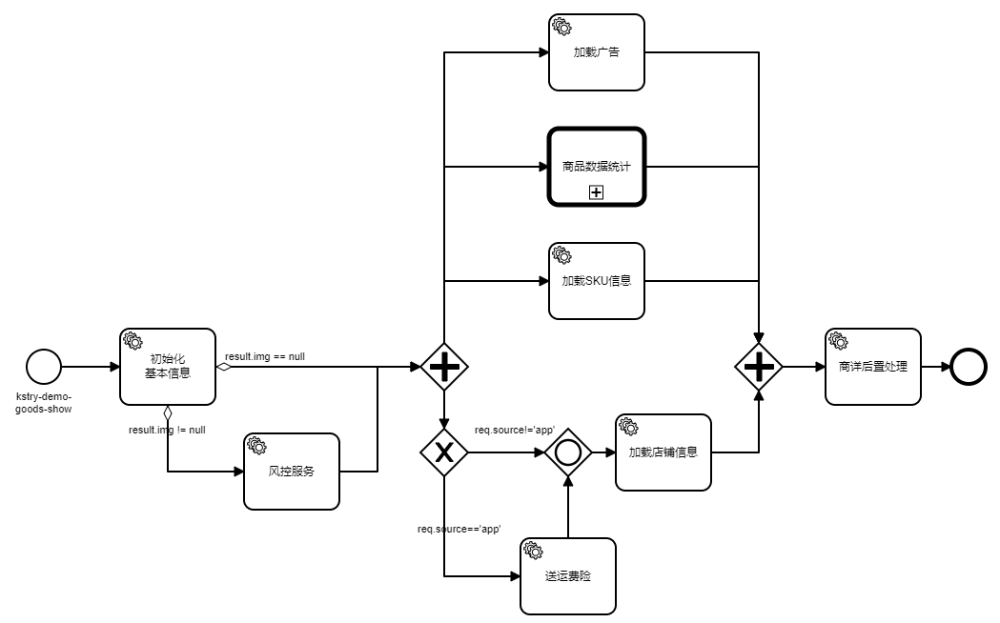 

- 这时候会收到错误信息：`[K1040004] No available TaskService matched! service task id: Activity_0ctfijm, name: 加载广告`
- 可通过给节点增加：`allow-absent=true`，来解决这个问题，该属性代表：允许配置节点找不到对应的服务任务节点，找不到时不会报错，会跳过继续执行

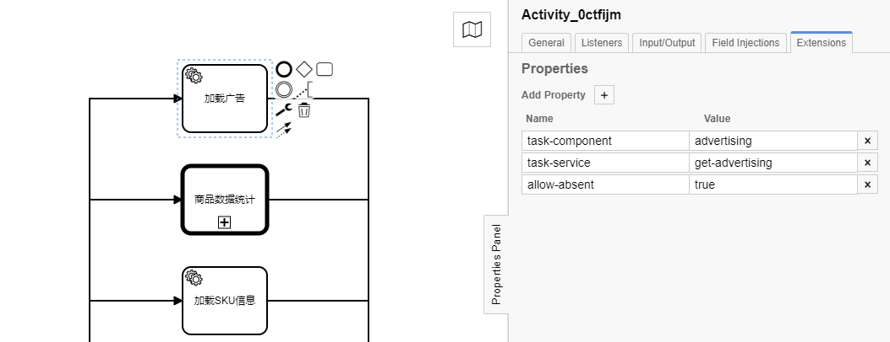

### 2.6.2 异常降级

> **场景假设：**在加载商品时，有着一个步骤是加载运费险信息。假设当下所依赖的物流系统极不稳定，获取运费险信息时经常出错。但是运费险信息又并非商品渲染流程的核心逻辑。所以在获取运费险失败时不应该中断整个流程，此时需要对问题节点降级处理，整体流程要继续向下执行

**代码中模拟异常：**

``` java
@TaskService(name = "get-logistic-insurance", noticeScope = ScopeTypeEnum.STABLE)
public LogisticInsurance getLogisticInsurance(GetLogisticInsuranceRequest request) {
    // 模拟异常
    int i = 1/0;
    log.info("request source：{}", request.getSource());
    LogisticInsurance logisticInsurance = new LogisticInsurance();
    logisticInsurance.setDesc("运费险描述");
    logisticInsurance.setType(1);
    return logisticInsurance;
}
```

**得到错误信息：**

``` log
...
Caused by: java.lang.ArithmeticException: / by zero
	at cn.kstry.demo.service.LogisticService.getLogisticInsurance(LogisticService.java:40)
	at sun.reflect.NativeMethodAccessorImpl.invoke0(Native Method)
	at sun.reflect.NativeMethodAccessorImpl.invoke(NativeMethodAccessorImpl.java:62)
	... 5 common frames omitted
```

**节点降级处理：**

可通过给节点增加：`strict-mode=false`属性，来关闭服务节点的严格模式（并行网关也有一个严格模式，要分清两者作用的不同），跳过异常，让流程得以继续向下执行

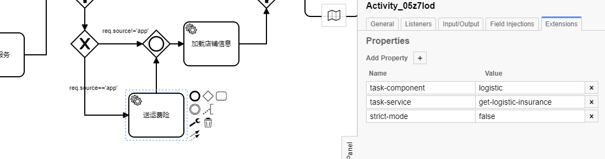


# 三、数据流转

> 前面演示了节点、网关、事件如何通过合适的编排来应对不断地业务变化所带来的挑战。编排好的流程图中节点与节点之间并非是完全独立的。风控审查的是商品基础信息中的图片，通过入参的来源判断是否赠送运费险，商品信息的后置处理将前面加载的一系列信息进行统一装配等等。节点间的关联无处不在。承载节点间通信工作最重要的角色就是 **StoryBus**

## 3.1 StoryBus介绍


- 每一个任务节点如果有需要，都可以从 StoryBus 中获取需要的参数，执行完之后，将需要的结果通知到 StoryBus
- StoryBus 中有四个数据域，分别是：
  - **req**：保存请求传入的request对象，request对象本身不会发生变化。但对象里面的值允许通过后期的变量通知发生更新
  - **sta**：保存节点执行完成后产生的变量，一经设置，将不再发生变化，如果出现重复设置会有警告日志（当只有对象的引用在sta域时，对象里面的字段还是可以发生更新的，这点与req相同）
  - **var**：保存节点执行完成后产生的变量，可以被重复替换，对象里面的字段性质同上
  - **result**：保存最终结果，作为 Story 执行完成后最终的结果返回给调用者
- 节点出度中，可以定义条件表达式直接引用这四个域做条件判断，如流程编排中出现的：`result.img != null`、`req.source!='app'`
- 四个作用域被读写锁保护着，get获取读锁，notice获取写锁，防止出现并发问题
- 开启异步模式后，同时创建的子任务都可以读写 StoryBus 中的变量，所以**数据方面有前后依赖关系的节点，不能被创建到同一时间段执行的不同子任务中**，可以通过聚合节点来保证节点执行时数据依赖的先后顺序

## 3.2 变量注解

###  3.2.1 获取变量

**@XxxTaskParam 注解：**

标注在服务任务节点入参前，从 StoryBus 中获取到变量后，直接赋值给参数变量，例如：

``` java
@TaskService(name = "get-evaluation-info", noticeScope = ScopeTypeEnum.STABLE)
public EvaluationInfo getEvaluationInfo(@ReqTaskParam("id") Long goodsId) {
    EvaluationInfo evaluationInfo = new EvaluationInfo();
    evaluationInfo.setEvaluateCount(20);
    log.info("goods id: {}, get EvaluationInfo: {}", goodsId, JSON.toJSONString(evaluationInfo));
    return evaluationInfo;
}
```

- `@TaskParam`：从 StoryBus 的 req、sta、var 域获取变量值，直接赋值给被标注参数
  - `value`：来源字段名
  - `scopeEnum`：指定是从哪个域获取字段，可取参数：`ScopeTypeEnum.STABLE`、`ScopeTypeEnum.VARIABLE`、`ScopeTypeEnum.REQUEST`
- `@ReqTaskParam`：从 StoryBus 的 req 域获取变量值，直接赋值给被标注参数
  - `value`：来源字段名
  - `reqSelf`：是否将客户端传入的 request 对象整体赋值给该参数，默认为：false
- `@StaTaskParam`：从 StoryBus 的 sta 域获取变量值，直接赋值给被标注参数
  - `value`：来源字段名
- `@VarTaskParam`：从 StoryBus 的 var 域获取变量值，直接赋值给被标注参数
  - `value`：来源字段名


**@XxxTaskField 注解：**

标注在服务任务节点入参对象中的字段上，从 StoryBus 中获取到变量后，直接赋值给被标注字段，例如：

``` java
@TaskComponent(name = "logistic")
public class LogisticService {

    @TaskService(name = "get-logistic-insurance", noticeScope = ScopeTypeEnum.STABLE)
    public LogisticInsurance getLogisticInsurance(GetLogisticInsuranceRequest request) {
        log.info("request source：{}", request.getSource());
        LogisticInsurance logisticInsurance = new LogisticInsurance();
        logisticInsurance.setDesc("运费险描述");
        logisticInsurance.setType(1);
        return logisticInsurance;
    }
}

@Data
public class GetLogisticInsuranceRequest {

    @ReqTaskField("source")
    private String source;
}
```

- `@TaskField`：从 StoryBus 的 req、sta、var 域获取变量值，赋值给被标注字段
  - `value`：来源字段名
  - `scopeEnum`：指定是从哪个域获取字段，可取参数：`ScopeTypeEnum.STABLE`、`ScopeTypeEnum.VARIABLE`、`ScopeTypeEnum.REQUEST`
- `@ReqTaskField`：从 StoryBus 的 req 域获取变量值，赋值给被标注字段
  - `value`：来源字段名
- `@StaTaskField`：从 StoryBus 的 sta 域获取变量值，赋值给被标注字段
  - `value`：来源字段名
- `@VarTaskField`：从 StoryBus 的 var 域获取变量值，赋值给被标注字段
  - `value`：来源字段名


### 3.2.2 通知变量

**@TaskService注解指定：**

服务任务节点上的`@TaskService`注解中可以设置 `noticeScope` 属性，用以告知容器，方法执行完后的结果被通知到 StoryBus 中的哪些作用域，例如：

``` java
@TaskComponent(name = "order")
public class OrderService {

    @TaskService(name = "get-order-info", noticeScope = {ScopeTypeEnum.STABLE, ScopeTypeEnum.VARIABLE})
    public OrderInfo getOrderInfo(@ReqTaskParam("id") Long goodsId) {
        OrderInfo orderInfo = new OrderInfo();
        orderInfo.setOrderedCount(10);
        log.info("goods id: {}, get OrderInfo: {}", goodsId, JSON.toJSONString(orderInfo));
        return orderInfo;
    }
}
```

- `noticeScope` 只能控制将方法返回的结果通知到哪些作用域，与结果对象中的字段没有关系
- `noticeScope` 支持数组类型，有效取值：`ScopeTypeEnum.STABLE`、`ScopeTypeEnum.VARIABLE`、`ScopeTypeEnum.RESULT`
- 方法返回结果被 `noticeScope` 通知后，如果结果类被**相同域**的 `@NoticeXxx` 注解修饰了，类上的注解将失效，以`noticeScope` 为准
- `noticeScope` 只能控制通知域，控制不了被通知目标的变量名称。默认情况下是服务任务节点方法返回值类名首字母小写作为变量名


**方法出参类中注解标注指定：**

注解可以标注在服务任务节点方法的结果类上，也可以标注在结果类的字段上，例如：

``` java
@NoticeSta(targrt = "goodsDetail")
public class GoodsDetail {

    private Long id;

    private String name;
}

@Data
@Builder
public class InitSkuResponse {

    @NoticeSta(targrt = "goodsDetail.skuInfos")
    private List<SkuInfo> skuInfos;
}
```

- `@NoticeAll`：可以标注在方法返回结果的类上或者类字段上，字段结果被通知到 StoryBus 中的 sta 和 var两个域中
  - `targrt`：通知到指定作用域的字段名

- `@NoticeSta`：可以标注在方法返回结果的类上或者类字段上，字段结果被通知到 StoryBus 中的 sta 域中
  - `targrt`：通知到指定作用域的字段名

- `@NoticeVar`：可以标注在方法返回结果的类上或者类字段上，字段结果被通知到 StoryBus 中的 var 域中
  - `targrt`：通知到指定作用域的字段名

- `@NoticeResult`：可以标注在方法返回结果的类上或者类字段上，字段结果被通知到 StoryBus 中的 result 域中

## 3.3 参数校验

- 服务任务节点方法参数如果是自定义对象时，对象中的字段支持JSR303格式校验
- 直接使用注解标注参数就会生效，如下`@NotBlank`：

``` java
@TaskComponent(name = "logistic")
public class LogisticService {

    @TaskService(name = "get-logistic-insurance", noticeScope = ScopeTypeEnum.STABLE)
    public LogisticInsurance getLogisticInsurance(GetLogisticInsuranceRequest request) {
        log.info("request source：{}", request.getSource());
        LogisticInsurance logisticInsurance = new LogisticInsurance();
        logisticInsurance.setDesc("运费险描述");
        logisticInsurance.setType(1);
        return logisticInsurance;
    }
}

@Data
public class GetLogisticInsuranceRequest {

    // 判断 source 不为空
    @NotBlank
    @ReqTaskField("source")
    private String source;
}
```

- 校验参数发现异常后，会中止 Story 流程，以异常的方式返回校验结果


## 3.4 参数生命周期

> **场景假设：**某些场景中，用户在界面上看到的店铺标签并非都是店铺服务自身维护的，可能有一部分需要实际使用到的业务方自己决定。但是“打店铺标签”这个能力又应该是店铺系统提供的众多服务能力列表中的一点，业务方系统不应该感知具体是怎么打标签的，只需要告知店铺系统打什么标签即可。根据关注点分离原则，商品服务中，如非必要不应该再掺杂店铺系统的能力点。如何才能使用店铺提供的能力在不违背关注点分离原则的前提下完成业务方的自定义诉求呢？

​        Kstry 提供了服务任务节点入参的生成方式自定义和生命周期方法。默认情况下入参对象是通过反射方式创建的，但如果有必要时可指定将参数交由 Spring 容器维护创建，这样就可以用到 Bean 对象的注入、生命周期方法等功能。

​        每一个服务任务节点都应该尽量遵循职能单一原则，商品业务中不应该再掺杂店铺业务的逻辑。商品的服务任务节点入参也应该只关注与自身业务相关的参数字段。但这时会需要一个适配器来做桥接，将A业务产生的结果转换成B业务所需的参数。服务任务节点入参对象的生命周期方法就可以充当这个适配器的功能。比如上面场景中的例子，可以在参数对象生命周期方法中调用店铺提供的服务能力完成打标签动作，后面方法再使用到的就是符合自己业务特点的店铺信息


**服务任务节点入参类：**

``` java
@Data
@SpringInitialization
public class DetailPostProcessRequest implements ParamLifecycle {

    @Resource
    private ShopService shopService;

    @StaTaskField("shopInfo")
    private ShopInfo shopInfo;
    
	...
        
    @Override
    public void before() {
        ParamLifecycle.super.before();
    }

    @Override
    public void after() {
        if (shopInfo != null) {
            shopService.makeLabel(shopInfo.getLabels());
        }
    }
}
```

- 定义 `ShopService` 变量，默认反射创建的情况下，该变量是不会被赋值的。参数类上标注`@SpringInitialization`注解，告知 Kstry 这个节点参数需要托管给 Spring 容器，此时 `ShopService` 变量就会被 Spring 容器注入值
- 参数类实现 `ParamLifecycle` 接口进行生命周期方法定义，接口有两个方法可以被重写
  - `before()`：参数对象创建后就会被调用，发生在Spring容器注入值之后，Kstry字段赋值之前
  -  `after()`：发生在字段赋值之后，用于对赋值后的参数进行再一步的处理
- 在 `after()`方法中调用 ShopService 的打标能力进行打标操作

> **注意**：节点方法参数被 @XxxTaskParam 注解修饰时，参数Bean字段装配、字段校验、Spring容器初始化、生命周期方法都会失效。原因是被 @XxxTaskParam 修饰的参数无需进行初始化和任何操作，会被 StoryBus 中获取到的值直接赋值

# 四、异步支持

> **场景假设：**继续延用商品展示的例子，在一个商品展示的 Story 中系统需要依赖很多服务，有内部的，也有外部的。内部服务毕竟在自己系统里，可控性相对较强，但不能避免的，也会出现一些耗时较高的操作。外部系统就更不用说了，作为研发一定吃过外部服务延时高可用性差的苦头。一般情况下，我们会引入异步化来尝试优化这些难缠的超时问题，Kstry又是如何做的呢？

## 4.1 超时时间

> Kstry 调用执行 Story 时，存在超时时间的限制，不会允许调用一直等待下去

**默认超时时间：**

系统默认超时时间是3s，请求开始执行后，如果3s内没有收到结果，就会报超时异常

```
cn.kstry.framework.core.exception.TaskAsyncException: [K1060002] Asynchronous node task timeout!
	at cn.kstry.framework.core.exception.KstryException.buildException(KstryException.java:88)
	at cn.kstry.framework.core.engine.AsyncTaskCell.get(AsyncTaskCell.java:107)
	at cn.kstry.framework.core.engine.StoryEngine.doFire(StoryEngine.java:184)
	at cn.kstry.framework.core.engine.StoryEngine.fire(StoryEngine.java:90)
	at cn.kstry.demo.web.GoodsController.showGoods(GoodsController.java:49)

Caused by: java.util.concurrent.TimeoutException: Async task timeout! maximum time limit: 3000ms, block task count: 1, block task: [Flow_0rl59u8]
	at cn.kstry.framework.core.engine.AsyncTaskCell.get(AsyncTaskCell.java:98)
	... 52 common frames omitted
```

**Kstry 提供了自定义超时时间的入口：**

- 配置全局超时时间：

  ```yaml
  # application.yml
  kstry:
    story:
      timeout: 3000 # 全局超时时间为 3000ms
  ```

- 显示指定超时时间:

  ``` java
  StoryRequest<GoodsDetail> req = ReqBuilder.returnType(GoodsDetail.class).timeout(3000).startId(StartIdEnum.GOODS_SHOW.getId()).request(request).build();
  TaskResponse<GoodsDetail> fire = storyEngine.fire(req);
  if (fire.isSuccess()) {
    return fire.getResult();
  }
  ```

- `timeout(3000)` 显示指定当前请求超时时间 3000ms。显示指定会覆盖全局配置的超时时间


## 4.2 开启异步

首先使用 sleep 模拟几个耗时的服务节点：“送运费险” sleep 100ms，“加载店铺信息” sleep 200ms，“加载评价数” sleep 200ms。调用一次接口，查看追踪日志（后面链路追踪环节会详细讲到，先使用这个功能）中重点需要关注的一些点：

``` json
// [http-nio-8080-exec-3][5837f673-15cd-4aef-97cc-6516ff14cb75] INFO  c.k.f.c.m.MonitorTracking - [K1040009] startId: kstry-demo-goods-show, spend 531ms ...

[{
	"methodName": "initBaseInfo",
	"nodeName": "初始化\n基本信息",
	"nodeType": "SERVICE_TASK",
	"spendTime": 1,
	"targetName": "cn.kstry.demo.service.GoodsService",
	"threadId": "kstry-task-thread-pool-1",
}, {
	"methodName": "checkImg",
	"nodeName": "风控服务",
	"nodeType": "SERVICE_TASK",
	"spendTime": 0,
	"targetName": "cn.kstry.demo.service.RiskControlService",
	"threadId": "kstry-task-thread-pool-1",
}, {
	"methodName": "initSku",
	"nodeName": "加载SKU信息",
	"nodeType": "SERVICE_TASK",
	"spendTime": 0,
	"targetName": "cn.kstry.demo.service.GoodsService",
	"threadId": "kstry-task-thread-pool-1",
}, {
	"methodName": "getLogisticInsurance",
	"nodeName": "送运费险",
	"nodeType": "SERVICE_TASK",
	"spendTime": 106,
	"targetName": "cn.kstry.demo.service.LogisticService",
	"threadId": "kstry-task-thread-pool-1",
}, {
	"methodName": "getShopInfoByGoodsId",
	"nodeName": "加载店铺信息",
	"nodeType": "SERVICE_TASK",
	"spendTime": 205,
	"targetName": "cn.kstry.demo.service.ShopService",
	"threadId": "kstry-task-thread-pool-1",
}, {
	"methodName": "getGoodsExtInfo",
	"nodeName": "加载收藏数",
	"nodeType": "SERVICE_TASK",
	"spendTime": 0,
	"targetName": "cn.kstry.demo.service.GoodsService",
	"threadId": "kstry-task-thread-pool-1",
}, {
	"methodName": "getOrderInfo",
	"nodeName": "加载下单数",
	"nodeType": "SERVICE_TASK",
	"spendTime": 0,
	"targetName": "cn.kstry.demo.service.OrderService",
	"threadId": "kstry-task-thread-pool-1",
}, {
	"methodName": "getEvaluationInfo",
	"nodeName": "加载评价数",
	"nodeType": "SERVICE_TASK",
	"spendTime": 205,
	"targetName": "cn.kstry.demo.service.EvaluationService",
	"threadId": "kstry-task-thread-pool-1",
}, {
	"nodeName": "加载广告",
	"nodeType": "SERVICE_TASK",
	"threadId": "kstry-task-thread-pool-1",
}, {
	"methodName": "detailPostProcess",
	"nodeName": "商详后置处理",
	"nodeType": "SERVICE_TASK",
	"spendTime": 1,
	"targetName": "cn.kstry.demo.service.GoodsService",
	"threadId": "kstry-task-thread-pool-1",
}]
```

- 服务任务节点依次执行，使用到的线程是同一线程：`kstry-task-thread-pool-1`
- 调用总耗时531ms。“送运费险”：106ms，“加载店铺信息”：205ms，“加载评价数”：205ms，时间基本都花在了这三个节点上，并且是累加计算的

**在子任务中，打开商品数据统计的异步化：**

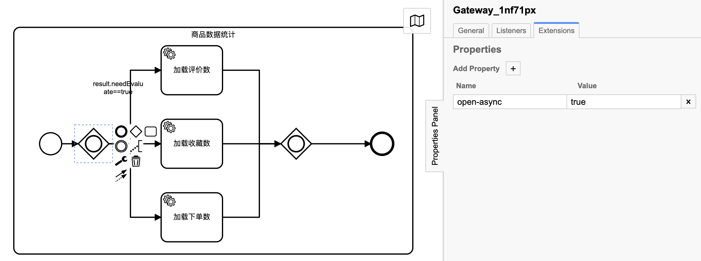 

**在主流程中打开店铺、商品、物流服务调用的异步化：**

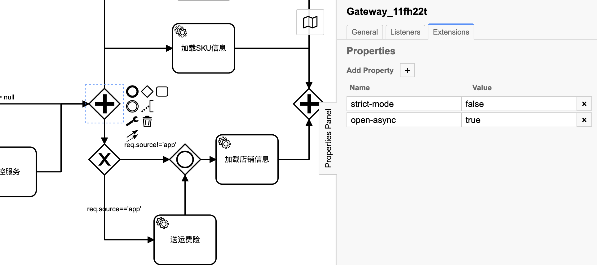

- 如图所见，开启异步功能就是如此的简单，在网关上配置`open-async=true`即可
- **目前支持配置异步开启的组件有：并行网关、包含网关两种**，排他网关虽然是允许有多个出度，但最终只有一个出度被执行，所以开启异步的效果不大并未支持开启异步
- 和普通的多线程使用方式一样，并发度太高也并非一定是好事。每开启一个新线程都要创建新的计算任务，加上线程间的上下文切换，在一些本来就耗时很短的任务节点间开启异步大多时候会得不偿失

**开启异步化后的统计日志：**

``` json
// [http-nio-8080-exec-8][7900a5a3-3c9c-44e4-914c-ac2d83e2c2f0] INFO  c.k.f.c.m.MonitorTracking - [K1040009] startId: kstry-demo-goods-show, spend 315ms ...

[{
	"methodName": "initBaseInfo",
	"nodeName": "初始化\n基本信息",
	"nodeType": "SERVICE_TASK",
	"spendTime": 2,
	"targetName": "cn.kstry.demo.service.GoodsService",
	"threadId": "kstry-task-thread-pool-3",
}, {
	"methodName": "checkImg",
	"nodeName": "风控服务",
	"nodeType": "SERVICE_TASK",
	"spendTime": 0,
	"targetName": "cn.kstry.demo.service.RiskControlService",
	"threadId": "kstry-task-thread-pool-3",
}, {
	"methodName": "initSku",
	"nodeName": "加载SKU信息",
	"nodeType": "SERVICE_TASK",
	"spendTime": 0,
	"targetName": "cn.kstry.demo.service.GoodsService",
	"threadId": "kstry-task-thread-pool-3",
}, {
	"nodeName": "加载广告",
	"nodeType": "SERVICE_TASK",
	"threadId": "kstry-task-thread-pool-1",
}, {
	"methodName": "getLogisticInsurance",
	"nodeName": "送运费险",
	"nodeType": "SERVICE_TASK",
	"spendTime": 102,
	"targetName": "cn.kstry.demo.service.LogisticService",
	"threadId": "kstry-task-thread-pool-7",
}, {
	"methodName": "getGoodsExtInfo",
	"nodeName": "加载收藏数",
	"nodeType": "SERVICE_TASK",
	"spendTime": 0,
	"targetName": "cn.kstry.demo.service.GoodsService",
	"threadId": "kstry-task-thread-pool-6",
}, {
	"methodName": "getOrderInfo",
	"nodeName": "加载下单数",
	"nodeType": "SERVICE_TASK",
	"spendTime": 0,
	"targetName": "cn.kstry.demo.service.OrderService",
	"threadId": "kstry-task-thread-pool-1",
}, {
	"methodName": "getEvaluationInfo",
	"nodeName": "加载评价数",
	"nodeType": "SERVICE_TASK",
	"spendTime": 201,
	"targetName": "cn.kstry.demo.service.EvaluationService",
	"threadId": "kstry-task-thread-pool-3",
}, {
	"methodName": "getShopInfoByGoodsId",
	"nodeName": "加载店铺信息",
	"nodeType": "SERVICE_TASK",
	"spendTime": 205,
	"targetName": "cn.kstry.demo.service.ShopService",
	"threadId": "kstry-task-thread-pool-7",
}, {
	"methodName": "detailPostProcess",
	"nodeName": "商详后置处理",
	"nodeType": "SERVICE_TASK",
	"spendTime": 1,
	"targetName": "cn.kstry.demo.service.GoodsService",
	"threadId": "kstry-task-thread-pool-7",
}]
```

- 总耗时 315ms，比未开启异步前少了大概200ms，可以分析下原因：

  - 耗时的节点有三个：“送运费险” sleep 100ms，“加载店铺信息” sleep 200ms，“加载评价数” sleep 200ms

  - “送运费险” 和 “加载店铺信息” 两个节点是串行执行的，所以耗时是累加的

  - “加载评价数” 虽然在子流程，但是子流程引用与上面两个节点是并行执行的

    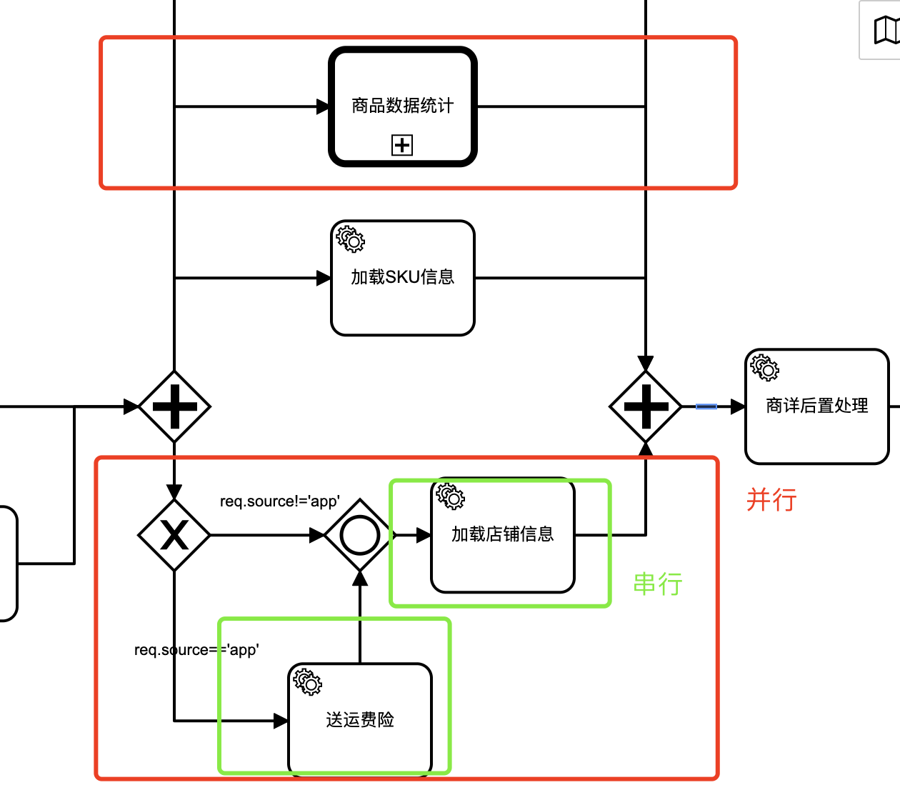 

  - 两个红框并行执行，两个绿框串行执行。两个并行流程中取耗时较大值300ms，所以最终耗时300ms左右

- 任务流中出现了不止一个的线程id，开启异步化后，任务创建并提交到线程池中，随机分配线程去执行

## 4.3 异步化生命周期

> 在并行网关、包含网关上配置`open-async=true`属性即可开启异步流程。那么异步的开始是什么时候，结束又是在何处呢？

### 4.3.1 异步的开始

**开始流程如下：**

- 执行引擎检测到并行网关、包含网关上配置`open-async=true`属性后，会将网关后面的出度包装成异步任务，并行网关与包含网关执行策略又略显不同：
  - 并行网关会将其后的全部出度逐一包装成异步任务，提交至线程池执行
  - 包含网关会判断其后的出度是否有条件表达式，如果有会先解析条件表达式，将表达式结果为true和没有表达式的出度逐一包装成异步任务提交到线程池执行
- 提交完异步任务的线程会继续执行任务栈中的其他节点任务，不会再顾及异步网关出度及出度之后的节点，直至任务栈中没有了可执行节点时线程会归还至线程池，等待下一次被调用
- 线程池随机选择线程执行上述流程中创建的异步任务

### 4.3.2 异步的结束

什么是异步？异步就是同一时间多个线程去做了多个事情，以此来节省需要一个线程做多个事情所花费的时间。这种模式有点像算法里面的空间换取时间的味道。Kstry中什么时候结束开启后的异步任务呢？答案是**多个可以同一时间执行的异步任务被聚合网关聚合后异步流程就结束了**。比如：

- 一个流程被并行网关拆分成了两个异步任务，这两个异步任务都遇到同一聚合节点后，任务就被聚合节点归拢了，异步任务也就结束了

- 一个流程被并行网关拆分成了两个异步任务，两个异步任务又分别拆分出了两个异步任务，只有四个异步任务全部聚合时，才算真正意义上的异步流程结束，如下的流程定义是允许的：

  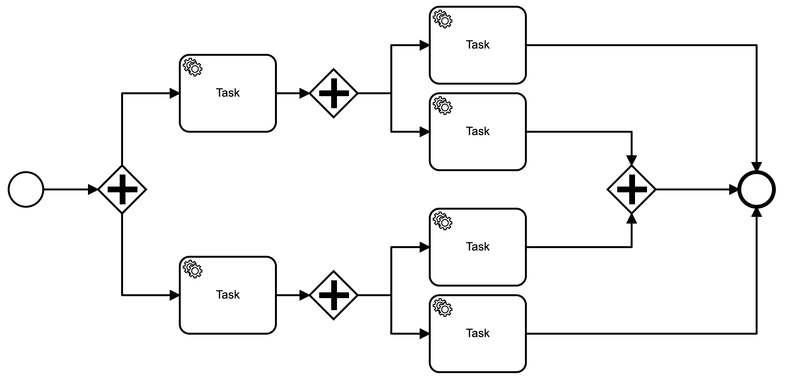 

**当前聚合节点的元素有：**

- 并行网关
- 包含网关
- 结束事件

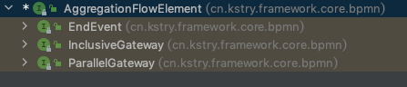  

**聚合节点可以随心所欲的聚合多个流程。除聚合节点外的其他节点元素，只允许接收一个入度**

> 之所以除聚合节点外的其他节点元素，只允许接收一个入度是因为：存在多个入度时，如果这些入度是异步的就会有多个线程执行到这个聚集点，假设Task节点可以支持多入度，那么Task节点就可能被执行多次。因为Task节点不具备聚合节点的能力，不能让前面的流程停下来等待全部流程都到达后才继续。换句话说只有聚合节点才能支持多入度

## 4.4 Reactor异步模型

> 开启了异步后是否程序就足够健壮了，就可以支持高流量请求了？答案是否定的，看下面的例子

还是上面的商品显示流程，其他节点的 sleep 模拟耗时全部清除，只留下“获取店铺信息” sleep 500ms 来模拟调用店铺接口时的耗时

``` java
@TaskService(name = "get-shopInfo-goodsId")
public ShopInfo getShopInfoByGoodsId(@ReqTaskParam("id") Long goodsId) throws InterruptedException {
    TimeUnit.MILLISECONDS.sleep(500L);
    ShopInfo shopInfo = goodsIdShopInfoMapping.get(goodsId);
    log.info("goods id: {}, getShopInfoByGoodsId: {}", goodsId, JSON.toJSONString(shopInfo));
    return shopInfo;
}
```

**进行一波小流量压测：**

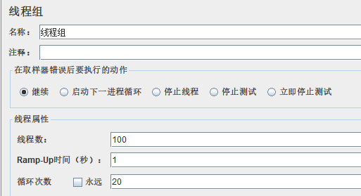  

**测试结果：**

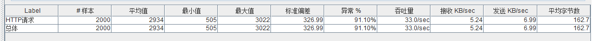  

**报错如下：**

```
cn.kstry.framework.core.exception.TaskAsyncException: [K1060002] Asynchronous node task timeout!
	at cn.kstry.framework.core.exception.KstryException.buildException(KstryException.java:88)
	at cn.kstry.framework.core.engine.AsyncTaskCell.get(AsyncTaskCell.java:107)
	at cn.kstry.framework.core.engine.StoryEngine.doFire(StoryEngine.java:184)
	at cn.kstry.framework.core.engine.StoryEngine.fire(StoryEngine.java:90)
	at cn.kstry.demo.web.GoodsController.showGoods(GoodsController.java:49)

Caused by: java.util.concurrent.TimeoutException: Async task timeout! maximum time limit: 3000ms, block task count: 1, block task: [Flow_0rl59u8]
	at cn.kstry.framework.core.engine.AsyncTaskCell.get(AsyncTaskCell.java:98)
	... 52 common frames omitted
```

2000个样本，失败率91.1%，服务基本是不可用状态。为什么会如此呢，难道是线程池队列满了？查看线程池日志：

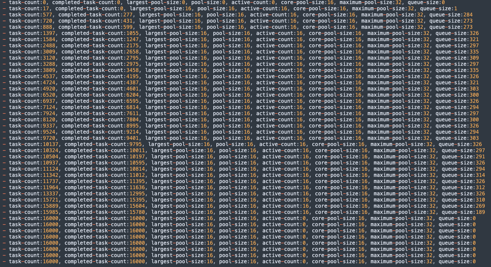 

核心线程数16个，最大线程数32个。整个测试下来，工作线程数一直等于核心线程数，任务队列也没满，所以可以确定不是线程池本身的问题

其实最根本的原因是出在了 sleep 500ms 的地方，工作线程都被占用了！可以分析下原理：

- 少量请求进来时，创建核心线程处理
- 核心线程达到阈值后，再有请求进来会放入阻塞队列
- 理论上线程池中阻塞队列满后才会再次创建线程。但是少量压测请求并未达到阻塞队列的上限，所以工作线程一直是核心线程16个
- 可以大概将线程处理一个请求的时间看作500ms，一秒之内16个线程可以处理32个请求，其他任务都被放入了队列
- 放入队列的任务等待3s后，会被超时中断，请求失败。这是大量异常出现的原因，并非队列满了而是等待超时了
- 如果我们增大超时时间，不难想象，队列任务数会增加。如果任务量足够大、超时时间足够长时，线程池队列也会溢出

要解决上述问题，就得从本质出发：工作线程将时间花费在了 sleep 500ms（比如调用外部接口）上，限制了任务的吞吐量。所以耗时的任务就应该交出去，比如在远程调用其他服务时，可以换成使用NIO的方式调用服务端接口，接口返回结果后再通知任务线程。Kstry中这样去做：

``` java
// 升级前获取店铺信息的任务
@TaskService(name = "get-shopInfo-goodsId")
public ShopInfo getShopInfoByGoodsId(@ReqTaskParam("id") Long goodsId) throws InterruptedException {
    TimeUnit.MILLISECONDS.sleep(500L);
    ShopInfo shopInfo = goodsIdShopInfoMapping.get(goodsId);
    log.info("goods id: {}, getShopInfoByGoodsId: {}", goodsId, JSON.toJSONString(shopInfo));
    return shopInfo;
}

// 升级后获取店铺信息的任务
@TaskService(name = "get-shopInfo-goodsId", returnClassType = ShopInfo.class)
public Mono<ShopInfo> getShopInfoByGoodsId(@ReqTaskParam("id") Long goodsId) {
    CompletableFuture<ShopInfo> future = new CompletableFuture<>();
    list.add(future);
    return Mono.fromFuture(future);
}

@Scheduled(fixedDelay = 500)
public void init() {
    List<CompletableFuture<ShopInfo>> completableFutures = Lists.newArrayList(list);
    list.clear();
    for (CompletableFuture<ShopInfo> cf : completableFutures) {
      ShopInfo shopInfo = goodsIdShopInfoMapping.get(1L);
      log.info("goods id: {}, getShopInfoByGoodsId: {}", 1, JSON.toJSONString(shopInfo));
      cf.complete(shopInfo);
    }
}
```

> 创建一个每 500ms 执行一次的定时器，拿到获取店铺信息时保存的 CompletableFuture 列表并将其中任务完成，以此来模拟获取店铺信息耗时在500ms以内

**原来任务做升级：**

- 返回值 ShopInfo 被 Mono 包装
- `@TaskService`注解增加属性配置：`returnClassType = ShopInfo.class`。之所以如此是因为结果的处理是通过解析方法结果类上的注解来做的，Java编译后泛型会被擦除，找不到返回值类型，无法解析判断处理返回结果的逻辑，所以返回值类型需要显示指定

> Kstry只支持 Mono，暂不支持 Flux

线程再次调用获取店铺信息节点时会立刻返回Mono。等异步完成任务后再反向通知流程继续

**同样的压测参数，重新压测：**

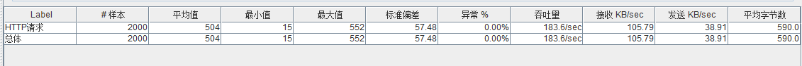

**将获取店铺信息的耗时模拟至1000ms再次测试：**

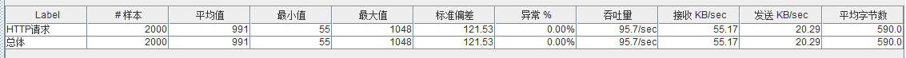

可见，问题解决了

Kstry 的 StoryEngine 还提供了异步调用入口，返回Mono，可与支持 Reactor 模型的 web服务器无缝衔接。比如：SpringFlux

``` java
public <T> Mono<T> fireAsync(StoryRequest<T> storyRequest) {
    try {
        MDC.put(GlobalProperties.KSTRY_STORY_REQUEST_ID_NAME, GlobalUtil.getOrSetRequestId(storyRequest));
        preProcessing(storyRequest);
        return doFireAsync(storyRequest);
    } finally {
        MDC.clear();
    }
}
```


# 五、RBAC模式

> **场景假设：**    
>
> ​    假设商品查询服务是中台服务，上游有着很多的业务方。对于大多数业务方来说，中台提供的能力是够用的，但有一个业务方突然站出来说，我这边的平台对信息的违规审查异常严格，你们提供的图片审查能力是不够用的，需要做升级。
>
> ​    于是我们找到了专门做图片审查的第三方公司。他们说可以很容易的接入使用，但是得收费，为了满足上游业务方的诉求，我们经过开会讨论和向上申请决定可以使用收费服务。但是领导还要求尽量节省开支，所以要求不严格的渠道还继续使用我们自己的图审查能力。
>
> ​    首先想到的是可以使用排他网关，如果是这个渠道走三方图片审查服务，如果是其他渠道就走默认图片审查。当下这个问题解决了，但是留下了一些问题：
>
> - 如果再新增其他渠道是不是还要修改判断逻辑
> - 如果又有其他渠道要使用新的风控组件审查图片，是不是还得继续新增判断逻辑、新增服务任务节点、修改流程图
> - 在中台产品看来，商品查询流程图上只有一个图片审查的功能，但是引入排他网关判断后会让商品查询的流程图变得不那么纯粹，不仅复杂难以理解，还包含了上游业务的特殊逻辑在里面，变得不易维护
>
> 应对这种问题，是时候使用 Kstry 的RBAC（Role-based access control）模式了

## 5.1 RBAC初体验

**增加图片校验服务：**

``` java
@TaskComponent(name = "risk-control")
public class RiskControlService {

    // 已有的本地图片审查服务
    @TaskService(name = "check-img")
    public void checkImg(CheckInfo checkInfo) {

        AssertUtil.notNull(checkInfo);
        AssertUtil.notBlank(checkInfo.getImg());
        log.info("check img: " + checkInfo.getImg());
    }

  	// 新增的三方图片审查服务
    @TaskService(name = "check-img", ability = "triple")
    public void tripleCheckImg(CheckInfo checkInfo) {

        AssertUtil.notNull(checkInfo);
        AssertUtil.notBlank(checkInfo.getImg());
        log.info("triple check img: " + checkInfo.getImg());
    }
}
```

- `@TaskService`注解增加了`ability = RiskControlCompKey.triple`属性，代表检测服务新增服务能力，名字是：triple

**注册角色：**

``` java
@Component
public class RoleRegister implements BusinessRoleRegister {

    @Override
    public List<BusinessRole> register() {

        List<String> list = Lists.newArrayList();
        list.add("r:init-base-info"); // r:服务名称，服务名称对应 @TaskService 的 name 属性值
        list.add("r:check-img@triple");// r:服务名称@能力名，能力名对应 @TaskService 的 ability 属性值
        list.add("r:get-logistic-insurance");
        list.add("r:get-shopInfo-goodsId");
        list.add("r:detail-post-process");
        list.add("r:init-sku");
        list.add("r:get-evaluation-info");
        list.add("r:get-goods-ext-info");
        list.add("r:get-order-info");
        List<Permission> permissions = PermissionUtil.permissionList(String.join(",", list));

        Role role = new BasicRole();
        role.addPermission(permissions);
        // businessId：special-channel
        // startId：kstry-demo-goods-show
        BusinessRole businessRole = new BusinessRole("special-channel", "kstry-demo-goods-show", role);
        return Lists.newArrayList(businessRole);
    }
}
```

- 实现`BusinessRoleRegister`接口，注册角色
- 注册类需要托管给 Spring 容器

**修改入参：**

``` java
@RestController
@RequestMapping("/goods")
public class GoodsController {

    @Resource
    private StoryEngine storyEngine;

    @PostMapping("/show")
    public GoodsDetail showGoods(@RequestBody GoodsDetailRequest request) {

        StoryRequest<GoodsDetail> req = ReqBuilder.returnType(GoodsDetail.class).startId("kstry-demo-goods-show").request(request).build();
        // 新增部分，如果 businessId 不为空，设置到 Kstry 入参中
        if (StringUtils.isNotBlank(request.getBusinessId())) {
            req.setBusinessId(request.getBusinessId());
        }
        TaskResponse<GoodsDetail> fire = storyEngine.fire(req);
        if (fire.isSuccess()) {
            return fire.getResult();
        }
        return null;
    }
}
```

**测试（未设置 businessId 时）：**

``` javascript
// 入参
{
    "id": 1,
    "source": "app"
}
// 日志：check img: https://xxx.png
```

**测试（设置 businessId 时）：**

``` javascript
// 入参
{
    "id": 1,
    "source": "app",
    "businessId": "special-channel"
}
// 日志：triple check img: https://xxx.png
```

- 未传入 businessId 时，使用的是内部图片审查服务，传入`businessId=special-channel`后使用三方图片审查服务

## 5.2 注册角色

### 5.2.1 权限分类

**权限类有两种**：

- `SimplePermission`：基础权限类，构造函数有两个重要属性：
  - identityType：权限的类型，支持两种：
    - `IdentityTypeEnum.SERVICE_TASK`  ：代表普通的服务任务节点比如上述：内部图片审查服务
    - `IdentityTypeEnum.SERVICE_TASK_ABILITY`：代表服务能力扩展点，对应于`@TaskService`注解设置了`ability`属性的服务能力节点，比如上述的：三方图片审查服务
  - identityId：权限的身份id，取值分两种情况
    - `identityType == IdentityTypeEnum.SERVICE_TASK`时：取`@TaskService`的`name`属性
    - `identityType == IdentityTypeEnum.SERVICE_TASK_ABILITY`：取`@TaskService`的`name`属性 + '@' + `ability`属性，比如：`check-img@triple`
- `TaskComponentPermission`：`SimplePermission`可以表示普通服务任务节点和服务能力扩展点。但是系统中如果存在两个名字一样但在不同`@TaskComponent`的能力点时，使用`SimplePermission`就无法进行区分了，需要使用`TaskComponentPermission`，它在前者的基础上增加了一个属性：
  - `taskComponentName`：对应`@TaskComponent`的`name`属性值，指定服务节点属于哪个任务组件

**上面的角色注册步骤可以修改成如下格式，效果一样：**

``` java
@Component
public class RoleRegister implements BusinessRoleRegister {

    @Override
    public List<BusinessRole> register() {

        List<Permission> permissions = Lists.newArrayList();
        permissions.add(new SimplePermission("init-base-info", IdentityTypeEnum.SERVICE_TASK));
        permissions.add(new SimplePermission("check-img@triple", IdentityTypeEnum.SERVICE_TASK_ABILITY));
        permissions.add(new SimplePermission("get-logistic-insurance", IdentityTypeEnum.SERVICE_TASK));
        permissions.add(new SimplePermission("get-shopInfo-goodsId", IdentityTypeEnum.SERVICE_TASK));
        permissions.add(new SimplePermission("detail-post-process", IdentityTypeEnum.SERVICE_TASK));
        permissions.add(new SimplePermission("init-sku", IdentityTypeEnum.SERVICE_TASK));
        permissions.add(new SimplePermission("get-evaluation-info", IdentityTypeEnum.SERVICE_TASK));
        permissions.add(new SimplePermission("get-goods-ext-info", IdentityTypeEnum.SERVICE_TASK));
        permissions.add(new SimplePermission("get-order-info", IdentityTypeEnum.SERVICE_TASK));

        Role role = new BasicRole();
        role.addPermission(permissions);
        // businessId：special-channel
        // startId：kstry-demo-goods-show
        BusinessRole businessRole = new BusinessRole("special-channel", "kstry-demo-goods-show", role);
        return Lists.newArrayList(businessRole);
    }
}
```

### 5.2.2 权限解析

**权限的字符串表示方式**：

- 普通服务任务节点：`r:service-name`或者`pr:service-name`
- 有能力扩展点的服务能力节点：`r:service-name@ability`
- 指定TaskComponent的普通服务任务节点：`pr:component@service-name`
- 指定TaskComponent的有能力扩展点的服务能力节点：`pr:component@service-name@ability`或者`r:component@service-name@ability`

> 使用 `cn.kstry.framework.core.util.PermissionUtil`可以将字符串解析成 Permission 对象

### 5.2.3 角色关系注册

**角色分配权限：**

``` java
Role role = new BasicRole();
role.addPermission(permissions);
```

**注册角色关系：**

- 新建类实现`BusinessRoleRegister`接口代表需要注册角色关系，将该类托管至 Spring 容器

- 实现接口中`List<BusinessRole> register()`方法，每一个BusinessRole都代表一个 startId、businessId 和 Role 的对应关系

- BusinessRole 可以指定：

  - 一个或多个 startId 与 Role 的对应关系
  - 一个或多个 businessId 和一个或多个 startId 与 Role 的对应关系

  ``` java
  public BusinessRole(String startId, Role role);
  
  public BusinessRole(List<String> startIdList, Role role);
  
  public BusinessRole(String businessId, String startId, Role role);
  
  public BusinessRole(String businessId, List<String> startIdList, Role role);
  
  public BusinessRole(List<String> businessIdList, String startId, Role role);
  
  public BusinessRole(List<String> businessIdList, List<String> startIdList, Role role);
  ```


## 5.3 匹配角色

### 5.3.1 静默匹配

每执行一个 Story 时，入参中 startId 是必传参数，businessId 参数选填。容器会根据这两个值来匹配 BusinessRole，如果匹配成功，拿到的 BusinessRole 中含有承载着权限的角色对象，如果角色对象不为空，每将要执行一个节点时，都会判断角色中是否含有当前要执行节点的权限，判断依据是：权限的 identityId 和identityType 与当前服务任务节点的`@TaskService.name`、`@TaskService.ability` 等属性相对应

根据 startId、businessId 匹配 BusinessRole 情况分类：

- Story入参只传入startId：
  - 匹配 `businessIdList.isEmpty()` 并且 `startIdList.contains(startId)` 的 BusinessRole，选取第一个匹配成功的返回
- Story入参传入 startId 和 businessId：
  - 匹配 `businessIdList.contains(businessId)` 并且 `startIdList.contains(startId)` 的 BusinessRole，选取第一个匹配成功的返回
  - 如果上一步返回为空，匹配 `businessIdList.isEmpty()` 并且 `startIdList.contains(startId)` 的 BusinessRole，选取第一个匹配成功的返回

### 5.3.2 显示指定

``` java
@RestController
@RequestMapping("/goods")
public class GoodsController {

    @Resource
    private StoryEngine storyEngine;

    @PostMapping("/show")
    public GoodsDetail showGoods(@RequestBody GoodsDetailRequest request) {

        // 创建角色，调用时显示指定
        Role role = new BasicRole();
        StoryRequest<GoodsDetail> req = ReqBuilder.returnType(GoodsDetail.class).role(role).startId("kstry-demo-goods-show").request(request).build();

        TaskResponse<GoodsDetail> fire = storyEngine.fire(req);
        if (fire.isSuccess()) {
            return fire.getResult();
        }
        return null;
    }
}
```

- **执行 Story 前如果显示指定了角色，角色的静默匹配会失效**

### 5.3.3 角色为空

​        一个Story中，调用前未显示指定角色并且静默匹配也失败时，角色对象为空。为空时一切指定了 `@TaskService.ability` 属性的**服务能力节点**都会失效，只有**服务任务节点**可以正常匹配执行。相当于并未开启RBAC模式，上面流程编排的例子全是这种情况。

​        如果角色对象不为空，服务节点被调用前都会使用该角色对象进行权限鉴权操作，如果鉴权失败就不会执行当前服务节点。所以**在RBAC模式下增加服务节点时，一定要对 StartId 和 BusinessId 做好权限的分配，否则将出现新增服务节点无法被执行的尴尬**。

## 5.4 动态修改权限

> **场景假设：**在RBAC模式下，有一个需求：当“初始化商品基本信息”后流程才有权限“加载SKU信息”

**角色关系注册时，不再添加”加载SKU信息“服务任务节点的权限：**

``` java
@Component
public class RoleRegister implements BusinessRoleRegister {

    @Override
    public List<BusinessRole> register() {

        List<String> list = Lists.newArrayList();
        list.add("r:init-base-info");
        list.add("r:check-img@triple");
        list.add("r:get-logistic-insurance");
        list.add("r:get-shopInfo-goodsId");
        list.add("r:detail-post-process");
//        list.add("r:init-sku");
        list.add("r:get-evaluation-info");
        list.add("r:get-goods-ext-info");
        list.add("r:get-order-info");
        List<Permission> permissions = PermissionUtil.permissionList(String.join(",", list));

        Role role = new BasicRole();
        role.addPermission(permissions);
        BusinessRole businessRole = new BusinessRole("special-channel", "kstry-demo-goods-show", role);
        return Lists.newArrayList(businessRole);
    }
}
```

**定义角色自定义组件：**

``` java
@CustomRole(name = "goods-custom-role")
public class GoodsCustomRole {

    @TaskService(name = "goods-detail")
    public void goodsDetail(@StaTaskParam GoodsDetail goodsDetail, Role role) {

        if (goodsDetail != null && role != null) {
            BasicRole basicRole = new BasicRole();
            basicRole.addPermission(PermissionUtil.permissionList("r:init-sku"));
            role.addParentRole(Sets.newHashSet(basicRole));
            log.info("add permission: {}", JSON.toJSONString(basicRole));
        }
    }
}
```

- 使用`@CustomRole`注解声明该类是自定义角色组件类
- 使用 `@TaskService`声明自定义角色的方法，方法不需要有出参，因为出参结果不会进行解析
- 自定义角色服务节点中在`@TaskService`注解设置的`ability`属性是无效的
- 只要服务任务节点方法参数中有Role类型的变量，会被自动注入在Story中流转的Role对象，其他类型参数值获取方式同普通的服务任务节点。但普通服务任务节点（非自定义角色服务节点）参数中如果出现Role类型时不会被赋值，会拿到null

**增加自定义角色声明：**

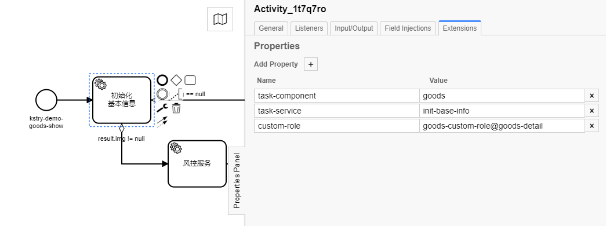 

-  定义`custom-role`属性，指定该服务任务节点执行完成后需要进行一次自定义角色操作。值格式：`component-name@service-name`
- 除了声明`custom-role`属性外，自定义角色节点也可以像普通服务节点一样在流程图中定义并参与执行

**测试日志：**

```
- add permission: {"parentRole":[],"permission":{"SERVICE_TASK":[{"identityId":"init-sku","identityType":"SERVICE_TASK"}]}}
```


## 5.5 角色匹配表达式

> **场景假设：**公司为了把控成本，要求如果使用到了图审查付费服务的业务要做好统计工作，记录使用次数，方便后面公司财务做账。也就是说，使用了三方服务的请求需要被统计，走内部审查服务的无需统计。换句话说在RBAC模式下只有使用到了 `r:check-img@triple` 权限的 Story 需要进行统计

**BPMN图示如下：**

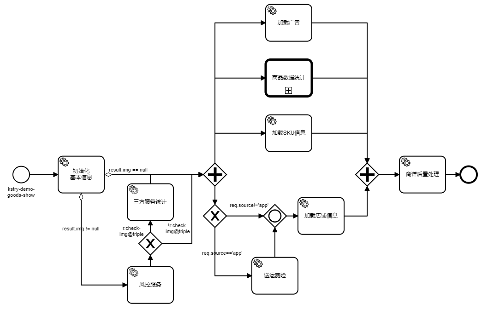

- `r:check-img@triple` 表达式代表当前执行的Story中Role不为空，并且含有该权限
- `!r:check-img@triple` 表达式代表当前执行的Story中Role为空，或者Role不为空但是不含有该权限
- 除`!`之外表达式还支持`()&|`四个符号组成的组合运算符。比如：`(r:init-base-info||r:init-sku)&&!r:get-order-info`。翻译就是`：(有加载商品基础信息的权限||有加载商品SKU的权限)&&没有获取订单信息的权限`

# 六、变量

> **场景假设：**成熟的项目中一定存在着繁杂且相互关联的业务逻辑关系，这些业务逻辑形成了服务的基础构架，以此应对着各种来自业务方、渠道方、甚至系统内部层出不穷的需求挑战。随着时间的推移，慢慢会发现，不同的渠道、不同的业务、甚至不同的生产环境对一些细节点的要求是不一样的。如何在保持原有架构清晰完整的前提下满足各种业务对自定义参数的诉求将是一个非常严峻的挑战。Kstry提供了灵活的业务变量定义方式，可以在业务域、服务域、和运行环境等维度进行分类定义获取

## 6.1 变量初体验

**`@EnableKstry`注解增加`propertiesPath`属性指定配置文件位置**

``` java
@EnableKstry(bpmnPath = "./bpmn/*.bpmn", propertiesPath = "./config/*.yml")
@SpringBootApplication
public class KstryDemoApplication {

    public static void main(String[] args) {
        SpringApplication.run(KstryDemoApplication.class, args);
    }
}
```

**创建配置文件并定义变量**

```yaml
# global-default.yml

default:
  banner: https://aass.png # 变量1
  shop-blacklist-ids: # 变量2
    - 2
    - 3
    - 4
    - 5
```

- **配置文件后缀名必须是yml、yaml否则无法解析**
- 配置文件名字本身无要求，只要符合`propertiesPath`的定义，都会进行解析
- `default:`是默认域，如果其他维度都没有解析到key对应的变量，会返回在 default 域中定义的变量

**使用变量**

```java
@TaskComponent(name = GoodsCompKey.goods)
public class GoodsService {

    @Resource
    private KvAbility kvAbility;

    @TaskService(name = "detail-post-process")
    public void detailPostProcess(DetailPostProcessRequest request) {

        List<String> list = kvAbility.getList("shop-blacklist-ids", String.class);
        String banner = kvAbility.getObject("banner", String.class).orElse(null);
        log.info("shop-blacklist-ids: {}", JSON.toJSONString(list));
        log.info("banner: {}", banner);
    }
}

// 日志：
// - shop-blacklist-ids: ["2","3","4","5"]
// - banner: https://aass.png
```

- KvAbility 是 Kstry 提供的获取变量的组件，所有变量都是通过这个组件获取的

## 6.2 服务维度变量

> **场景假设：**在加载店铺信息时需要设置店铺的标签信息，而标签信息又是经常变化的，所以应该以变量的形式存在。如果放在default域，后面业务变量多了之后会太过混乱，显然是不合适的。这时就应该按照服务维度来划分变量

**定义变量**

``` yaml
# goods-config.yml

init-shop-info:
  labels:
    - url: https://xxx.png
      name: L1
      index: 1
    - url: https://xxx2.png
      name: L2
      index: 2
```

- 如果将配置信息还放在`global-default.yml`中也是可以执行的，但为了区分开看着更清楚，可以再新建一个专门放商品服务配置的配置文件
- `init-shop-info`也是一个域，和`default`属于同一类型。不同的是`default`是全局默认域用来兜底，前者则需要显示指定使用才能起作用

**服务维度使用变量**

``` java
@TaskComponent(name = ShopCompKey.shop)
public class ShopService {

    @Resource
    private KvAbility kvAbility;

		@TaskService(name = "get-shopInfo-goodsId", kvScope = "init-shop-info")
		public ShopInfo getShopInfoByGoodsId(@ReqTaskParam("id") Long goodsId) throws InterruptedException {
  	 	  List<ShopLabel> labels = kvAbility.getList("labels", ShopLabel.class);
      	...
		}
}
```

- `@TaskService`注解有`kvScope`属性可以指定变量的服务域，指定该变量后，执行当前服务节点时容器会先从指定服务域查找变量，找不到时才从default域取


## 6.3 业务维度变量

> **场景假设：**还是风控审查图片的例子，假设现在有很多业务线都在使用这个图片审查的能力，但是不同业务线对图片尺寸的要求不一样。这时如果只是在`@TaskService`注解中定义`kvScope`属性显然是不行的。因为无法区分是哪个业务线，图片需要满足什么尺寸的要求。如何才可以在业务维度使用变量呢？

**定义变量**

```yaml
# risk-control-config.yml 同样是为了维护和阅读方便才新建的文件

# 风控默认配置
risk-control: # 服务维度
  img-max-size: 100

# 业务维度变量配置
special-channel: # 对应请求入参传入的businessId（业务域）
  risk-control: # 风控域变量（服务域）
    img-max-size: 200 # 指定变量值
```

- `risk-control`是服务域变量名，定义了与风控服务相关的变量
- `special-channel`是业务域变量名，对应于请求入参传入的businessId。businessId匹配成功后会匹配当前执行的服务节点是否是在`risk-control`服务域下，如果也匹配成功会获取`img-max-size=200`。否则使用`risk-control`域变量，如果还是没有则使用default域变量

**业务维度使用变量**

``` java
@TaskComponent(name = "risk-control")
public class RiskControlService {

    @Resource
    private KvAbility kvAbility;

    @TaskService(name = "check-img", kvScope = "risk-control")
    public void checkImg(CheckInfo checkInfo) {

        AssertUtil.notNull(checkInfo);
        AssertUtil.notBlank(checkInfo.getImg());
        log.info("check img: {}, size: {}", checkInfo.getImg(), kvAbility.getString("img-max-size").orElse(null));
    }

    @TaskService(name = "check-img", kvScope = "risk-control", ability = "triple")
    public void tripleCheckImg(CheckInfo checkInfo) {

        AssertUtil.notNull(checkInfo);
        AssertUtil.notBlank(checkInfo.getImg());
        log.info("triple check img: {}, size: {}", checkInfo.getImg(), kvAbility.getString("img-max-size").orElse(null));
    }
}
```

- `@TaskService`注解指定`kvScope`属性，说明当前服务节点在`risk-control`服务域下。如果业务维度没匹配成功则会使用服务域的变量，如果还是匹配会尝试使用default域变量

``` java
@RestController
@RequestMapping("/goods")
public class GoodsController {

    @Resource
    private StoryEngine storyEngine;

    @PostMapping("/show")
    public GoodsDetail showGoods(@RequestBody GoodsDetailRequest request) {

        StoryRequest<GoodsDetail> req = ReqBuilder.returnType(GoodsDetail.class).startId("kstry-demo-goods-show").request(request).build();
        if (StringUtils.isNotBlank(request.getBusinessId())) {
            req.setBusinessId(request.getBusinessId());
        }
        TaskResponse<GoodsDetail> fire = storyEngine.fire(req);
        if (fire.isSuccess()) {
            return fire.getResult();
        }
        return null;
    }
}
```

- 业务维度变量起作用的重点是businessId，此例中`businessId=special-channel`时，匹配`special-channel`域的变量

## 6.4 环境维度变量

> **场景假设：**针对店铺黑名单，生产环境与开发环境不一样，如何满足呢？

**定义变量**

``` yaml
# global-default.yml

default:
  banner: https://aass.png
  shop-blacklist-ids:
    - 2
    - 3
    - 4
    - 5

default@dev:
  shop-blacklist-ids:
    - 8
    - 9
```

- 如`default@dev`，指定域所属环境的格式是：变量域名 + @ + 环境
- 此处的环境与 Spring 中的 ActiveProfiles 是对应的
- 如果dev环境未匹配到，会匹配没有指定环境的同域名变量
- 业务维度变量，环境参数同样定义在业务域名字后面

**使用变量**

```java
@TaskComponent(name = GoodsCompKey.goods)
public class GoodsService {

    @Resource
    private KvAbility kvAbility;

    @TaskService(name = "detail-post-process")
    public void detailPostProcess(DetailPostProcessRequest request) {

        // 从 default 域，获取店铺黑名单
        List<String> list = kvAbility.getList("shop-blacklist-ids", String.class);
        String banner = kvAbility.getObject("banner", String.class).orElse(null);
        log.info("shop-blacklist-ids: {}", JSON.toJSONString(list));
        log.info("banner: {}", banner);
    }
}

// dev 环境日志
// - shop-blacklist-ids: ["8","9"]
// - banner: https://aass.png

// 非 dev 环境日志
// - shop-blacklist-ids: ["2","3","4","5"]
// - banner: https://aass.png
```

## 6.5 获取变量顺序

**带businessId获取变量与不带businessId获取变量步骤如图所示：**

.png) 

**带businessId获取变量：**

- 找业务维度中的，环境匹配且服务域也匹配的变量，如果有返回对应值，结束获取流程，若没有继续下一步
- 找业务维度中的，服务域匹配的变量，如果有返回对应值，结束获取流程，若没有继续下一步
- 找业务维度中的，环境匹配且是default域的变量，如果有返回对应值，结束获取流程，若没有继续下一步
- 找业务维度中的，是default域的变量，如果有返回对应值，结束获取流程，若没有继续下一步
- 找环境匹配且服务域也匹配的变量，如果有返回对应值，结束获取流程，若没有继续下一步
- 找服务域匹配的变量，如果有返回对应值，结束获取流程，若没有继续下一步
- 找环境匹配且是default域的变量，如果有返回对应值，结束获取流程，若没有继续下一步
- 找是default域的变量，如果有返回对应值，结束获取流程，若没有返回空

**不带businessId获取变量：**

- 找环境匹配且服务域也匹配的变量，如果有返回对应值，结束获取流程，若没有继续下一步
- 找服务域匹配的变量，如果有返回对应值，结束获取流程，若没有继续下一步
- 找环境匹配且是default域的变量，如果有返回对应值，结束获取流程，若没有继续下一步
- 找是default域的变量，如果有返回对应值，结束获取流程，若没有返回空


# 七、链路追踪

> 研发工作中遇到过最为抓狂的事情可能就是排查线上问题了。明显易发现的问题还好，但有些问题只在生产环境的高并发真实流量场景中才会出现，相同的分支代码放到线下又可以正常运行了，每当此时也只能以问题很难复现再观察定位的话术来敷衍。那么生产环境问题为什么难定位呢：
>
> - 生产环境不能debug，看不到流程的全貌，很多时候流程真正的执行链路需要靠猜测
> - 虽然可以通过日志查看到很多细节和问题，但日志又不能无限制的使用，不然即影响了开发效率，又影响了代码的可读性，日志加的太多还容易造成生产环境机器的计算资源、存储资源浪费
> - 一些极端场景的链路或数据，只有生产环境才会出现
>
> 为了减少问题排查的复杂程度，Kstry 提供了流程回溯功能，流程回溯记录了节点的信息、执行顺序、耗时、入参、出参等重要数据

## 7.1 traceId支持

Kstry 内部使用MDC工具，支持设置全链路请求ID

- `StoryEngine.fire`入参中有`requestId`属性可以指定当前请求的唯一ID，如果未指定引擎会使用UUID生成一个

- 日志打印时可以获取 traceId 来串联当前请求的全部日志，traceId 默认名是：`ks-request-id`

  ``` xml
  <property name="FILE_LOG_PATTERN" value="%d{yyyy-MM-dd HH:mm:ss.SSS} [%thread][%X{ks-request-id}] %-5level %logger{20} - %msg%n"/>
  ```

- traceId 默认名可以修改：

  ``` yaml
  # application.yml
  kstry:
    story:
      request-id: traceId
  ```


## 7.2 流程回溯

### 7.2.1 流程回溯类型

Kstry 支持五种模式的回溯

- `NONE`：不开启回溯功能
- `ALL`：开启全部采集点的回溯，包括所有bpmn元素执行，节点信息，节点入参，节点出参，耗时等
- `NODE`：只采集bpmn节点执行流程，不关注节点执行细节
- `SERVICE`：只关注bpmn元素中的 ServiceTask 节点，也就是服务任务节点的执行，采集节点的信息、耗时、执行顺序等，但是不采集出参、入参
- `SERVICE_DETAIL`：在`SERVICE`的基础上增加了对出参、入参的采集


### 7.2.2 流程回溯使用

**执行入参中显示指定：**

``` java
@RestController
@RequestMapping("/goods")
public class GoodsController {

    @Resource
    private StoryEngine storyEngine;

    @PostMapping("/show")
    public GoodsDetail showGoods(@RequestBody GoodsDetailRequest request) {

        StoryRequest<GoodsDetail> req = ReqBuilder.returnType(GoodsDetail.class).startId("kstry-demo-goods-show").trackingType(TrackingTypeEnum.SERVICE).request(request).build();
        TaskResponse<GoodsDetail> fire = storyEngine.fire(req);
        if (fire.isSuccess()) {
            return fire.getResult();
        }
        return null;
    }
}
```

**全局默认配置：**

``` yaml
# application.yml

kstry:
  story:
    tracking:
      type: service
      log: true # 是否打印回溯log，默认为 true
```

### 7.2.3 回溯日志样例

- `ALL`：

  ``` javascript
  [K1040009] startId: kstry-demo-goods-show, spend 631ms:  [{
      "index": 1,
      "nodeId": "kstry-demo-goods-show",
      "nodeName": "kstry-demo-goods-show",
      "nodeType": "START_EVENT",
      "noticeTracking": [],
      "paramTracking": [],
      "startTime": "2021-12-17T01:36:20.926",
      "threadId": "kstry-task-thread-pool-0",
      "toNodeIds": ["Flow_1uuw3lx"]
  }, {
      "index": 2,
      "nodeId": "Flow_1uuw3lx",
      "nodeType": "SEQUENCE_FLOW",
      "noticeTracking": [],
      "paramTracking": [],
      "startTime": "2021-12-17T01:36:20.926",
      "threadId": "kstry-task-thread-pool-0",
      "toNodeIds": ["Activity_1t7q7ro"]
  }, {
      "endTime": "2021-12-17T01:36:20.993",
      "index": 3,
      "methodName": "initBaseInfo",
      "nodeId": "Activity_1t7q7ro",
      "nodeName": "初始化\n基本信息",
      "nodeType": "SERVICE_TASK",
      "noticeTracking": [{
          "fieldName": "goodsDetail",
          "noticeName": "goodsDetail",
          "noticeScopeType": "STABLE",
          "value": "{\"id\":1,\"img\":\"https://xxx.png\",\"name\":\"商品\",\"needEvaluate\":true}"
      }, {
          "noticeScopeType": "RESULT",
          "value": "{\"id\":1,\"img\":\"https://xxx.png\",\"name\":\"商品\",\"needEvaluate\":true}"
      }],
      "paramTracking": [{
          "paramName": "request",
          "sourceName": "request",
          "sourceScopeType": "REQUEST",
          "value": "{\"businessId\":\"special-channel\",\"id\":1,\"source\":\"app\"}"
      }, {
          "paramName": "goodsDetail",
          "sourceName": "goodsDetail",
          "sourceScopeType": "STABLE",
          "value": "{\"id\":1,\"img\":\"https://xxx.png\",\"name\":\"商品\",\"needEvaluate\":true}"
      }, {
          "paramName": "role",
          "sourceName": "role",
          "sourceScopeType": "EMPTY",
          "value": "null"
      }],
      "spendTime": 67,
      "startTime": "2021-12-17T01:36:20.926",
      "targetName": "cn.kstry.demo.service.GoodsService",
      "threadId": "kstry-task-thread-pool-0",
      "toNodeIds": ["Flow_0dt6q7w"]
  }
  ......
  {
      "endTime": "2021-12-17T01:36:21.549",
      "index": 46,
      "methodName": "detailPostProcess",
      "nodeId": "Activity_1s51gmf",
      "nodeName": "商详后置处理",
      "nodeType": "SERVICE_TASK",
      "noticeTracking": [],
      "paramTracking": [{
          "paramName": "request.shopInfo",
          "sourceName": "shopInfo",
          "sourceScopeType": "STABLE",
          "value": "{\"id\":1,\"labels\":[{\"index\":1,\"name\":\"L1\",\"url\":\"https://xxx.png\"},{\"index\":2,\"name\":\"L2\",\"url\":\"https://xxx2.png\"}],\"salesNumMonthly\":22,\"shopName\":\"店铺名称\"}"
      }, {
          "paramName": "request.goodsDetail",
          "sourceName": "goodsDetail",
          "sourceScopeType": "STABLE",
          "value": "{\"id\":1,\"img\":\"https://xxx.png\",\"name\":\"商品\",\"needEvaluate\":true,\"skuInfos\":[{\"img\":\"https://xxx.png\",\"price\":1000,\"skuId\":100,\"skuName\":\"sku1\",\"stock\":10},{\"img\":\"https://xxx2.png\",\"price\":2000,\"skuId\":101,\"skuName\":\"sku2\",\"stock\":20}]}"
      }, {
          "paramName": "request.logisticInsurance",
          "sourceName": "logisticInsurance",
          "sourceScopeType": "STABLE",
          "value": "{\"desc\":\"运费险描述\",\"type\":1}"
      }, {
          "paramName": "request.evaluationInfo",
          "sourceName": "evaluationInfo",
          "sourceScopeType": "STABLE",
          "value": "{\"evaluateCount\":20}"
      }, {
          "paramName": "request.orderInfo",
          "sourceName": "orderInfo",
          "sourceScopeType": "STABLE",
          "value": "{\"orderedCount\":10}"
      }, {
          "paramName": "request.goodsExtInfo",
          "sourceName": "goodsExtInfo",
          "sourceScopeType": "STABLE",
          "value": "{\"collectCount\":30}"
      }],
      "spendTime": 11,
      "startTime": "2021-12-17T01:36:21.538",
      "targetName": "cn.kstry.demo.service.GoodsService",
      "threadId": "kstry-task-thread-pool-8",
      "toNodeIds": ["Flow_0rl59u8"]
  }, {
      "index": 47,
      "nodeId": "Flow_0rl59u8",
      "nodeType": "SEQUENCE_FLOW",
      "noticeTracking": [],
      "paramTracking": [],
      "startTime": "2021-12-17T01:36:21.549",
      "threadId": "kstry-task-thread-pool-8",
      "toNodeIds": ["Event_1yjag2c"]
  }, {
      "index": 48,
      "nodeId": "Event_1yjag2c",
      "nodeType": "END_EVENT",
      "noticeTracking": [],
      "paramTracking": [],
      "startTime": "2021-12-17T01:36:21.550",
      "threadId": "kstry-task-thread-pool-8",
      "toNodeIds": []
  }]
  ```

- `NODE`：

  ``` javascript
  [K1040009] startId: kstry-demo-goods-show, spend 772ms: 
  [{
      "index": 1,
      "nodeId": "kstry-demo-goods-show",
      "nodeName": "kstry-demo-goods-show",
      "nodeType": "START_EVENT",
      "noticeTracking": [],
      "paramTracking": [],
      "toNodeIds": ["Flow_1uuw3lx"]
  }, {
      "index": 2,
      "nodeId": "Flow_1uuw3lx",
      "nodeType": "SEQUENCE_FLOW",
      "noticeTracking": [],
      "paramTracking": [],
      "toNodeIds": ["Activity_1t7q7ro"]
  }, {
      "index": 3,
      "nodeId": "Activity_1t7q7ro",
      "nodeName": "初始化\n基本信息",
      "nodeType": "SERVICE_TASK",
      "noticeTracking": [],
      "paramTracking": [],
      "toNodeIds": ["Flow_0dt6q7w"]
  }
  ......
  {
      "index": 46,
      "nodeId": "Activity_1s51gmf",
      "nodeName": "商详后置处理",
      "nodeType": "SERVICE_TASK",
      "noticeTracking": [],
      "paramTracking": [],
      "toNodeIds": ["Flow_0rl59u8"]
  }, {
      "index": 47,
      "nodeId": "Flow_0rl59u8",
      "nodeType": "SEQUENCE_FLOW",
      "noticeTracking": [],
      "paramTracking": [],
      "toNodeIds": ["Event_1yjag2c"]
  }, {
      "index": 48,
      "nodeId": "Event_1yjag2c",
      "nodeType": "END_EVENT",
      "noticeTracking": [],
      "paramTracking": [],
      "toNodeIds": []
  }]
  ```

- `SERVICE`：

  ``` javascript
  [K1040009] startId: kstry-demo-goods-show, spend 325ms: 
  [{
      "endTime": "2021-12-17T01:41:54.152",
      "index": 3,
      "methodName": "initBaseInfo",
      "nodeId": "Activity_1t7q7ro",
      "nodeName": "初始化\n基本信息",
      "nodeType": "SERVICE_TASK",
      "noticeTracking": [],
      "paramTracking": [],
      "spendTime": 57,
      "startTime": "2021-12-17T01:41:54.095",
      "targetName": "cn.kstry.demo.service.GoodsService",
      "threadId": "kstry-task-thread-pool-0",
      "toNodeIds": ["Activity_1iu4r2e"]
  }, {
      "ability": "triple",
      "endTime": "2021-12-17T01:41:54.190",
      "index": 5,
      "methodName": "tripleCheckImg",
      "nodeId": "Activity_1iu4r2e",
      "nodeName": "风控服务",
      "nodeType": "SERVICE_TASK",
      "noticeTracking": [],
      "paramTracking": [],
      "spendTime": 33,
      "startTime": "2021-12-17T01:41:54.157",
      "targetName": "cn.kstry.demo.service.RiskControlService",
      "threadId": "kstry-task-thread-pool-0",
      "toNodeIds": ["Activity_1nhha2f"]
  }
  ......
  {
      "endTime": "2021-12-17T01:41:54.243",
      "index": 42,
      "methodName": "getShopInfoByGoodsId",
      "nodeId": "Activity_019xur8",
      "nodeName": "加载店铺信息",
      "nodeType": "SERVICE_TASK",
      "noticeTracking": [],
      "paramTracking": [],
      "spendTime": 13,
      "startTime": "2021-12-17T01:41:54.230",
      "targetName": "cn.kstry.demo.service.ShopService",
      "threadId": "kstry-task-thread-pool-2",
      "toNodeIds": ["Activity_1s51gmf"]
  }, {
      "endTime": "2021-12-17T01:41:54.409",
      "index": 46,
      "methodName": "detailPostProcess",
      "nodeId": "Activity_1s51gmf",
      "nodeName": "商详后置处理",
      "nodeType": "SERVICE_TASK",
      "noticeTracking": [],
      "paramTracking": [],
      "spendTime": 10,
      "startTime": "2021-12-17T01:41:54.399",
      "targetName": "cn.kstry.demo.service.GoodsService",
      "threadId": "kstry-task-thread-pool-8",
      "toNodeIds": []
  }]
  ```

- `SERVICE_DETAIL`：

  ``` javascript
   [K1040009] startId: kstry-demo-goods-show, spend 284ms:
   [{
       "endTime": "2021-12-17T01:43:43.177",
       "index": 3,
       "methodName": "initBaseInfo",
       "nodeId": "Activity_1t7q7ro",
       "nodeName": "初始化\n基本信息",
       "nodeType": "SERVICE_TASK",
       "noticeTracking": [{
           "fieldName": "goodsDetail",
           "noticeName": "goodsDetail",
           "noticeScopeType": "STABLE",
           "value": "{\"id\":1,\"img\":\"https://xxx.png\",\"name\":\"商品\",\"needEvaluate\":true}"
       }, {
           "noticeScopeType": "RESULT",
           "value": "{\"id\":1,\"img\":\"https://xxx.png\",\"name\":\"商品\",\"needEvaluate\":true}"
       }],
       "paramTracking": [{
           "paramName": "request",
           "sourceName": "request",
           "sourceScopeType": "REQUEST",
           "value": "{\"businessId\":\"special-channel\",\"id\":1,\"source\":\"app\"}"
       }, {
           "paramName": "goodsDetail",
           "sourceName": "goodsDetail",
           "sourceScopeType": "STABLE",
           "value": "{\"id\":1,\"img\":\"https://xxx.png\",\"name\":\"商品\",\"needEvaluate\":true}"
       }, {
           "paramName": "role",
           "sourceName": "role",
           "sourceScopeType": "EMPTY",
           "value": "null"
       }],
       "spendTime": 57,
       "startTime": "2021-12-17T01:43:43.120",
       "targetName": "cn.kstry.demo.service.GoodsService",
       "threadId": "kstry-task-thread-pool-0",
       "toNodeIds": ["Activity_1iu4r2e"]
   }, {
       "ability": "triple",
       "endTime": "2021-12-17T01:43:43.210",
       "index": 5,
       "methodName": "tripleCheckImg",
       "nodeId": "Activity_1iu4r2e",
       "nodeName": "风控服务",
       "nodeType": "SERVICE_TASK",
       "noticeTracking": [],
       "paramTracking": [{
           "paramName": "checkInfo.img",
           "sourceName": "goodsDetail.img",
           "sourceScopeType": "STABLE",
           "value": "https://xxx.png"
       }],
       "spendTime": 29,
       "startTime": "2021-12-17T01:43:43.181",
       "targetName": "cn.kstry.demo.service.RiskControlService",
       "threadId": "kstry-task-thread-pool-0",
       "toNodeIds": ["Activity_1nhha2f"]
   }
   ...... 
   {
       "endTime": "2021-12-17T01:43:43.260",
       "index": 42,
       "methodName": "getShopInfoByGoodsId",
       "nodeId": "Activity_019xur8",
       "nodeName": "加载店铺信息",
       "nodeType": "SERVICE_TASK",
       "noticeTracking": [{
           "fieldName": "shopInfo",
           "noticeName": "shopInfo",
           "noticeScopeType": "STABLE",
           "value": "{\"id\":1,\"salesNumMonthly\":22,\"shopName\":\"店铺名称\"}"
       }],
       "paramTracking": [{
           "paramName": "goodsId",
           "sourceName": "id",
           "sourceScopeType": "REQUEST",
           "value": "1"
       }],
       "spendTime": 13,
       "startTime": "2021-12-17T01:43:43.247",
       "targetName": "cn.kstry.demo.service.ShopService",
       "threadId": "kstry-task-thread-pool-2",
       "toNodeIds": ["Activity_1s51gmf"]
   }, {
       "endTime": "2021-12-17T01:43:43.394",
       "index": 46,
       "methodName": "detailPostProcess",
       "nodeId": "Activity_1s51gmf",
       "nodeName": "商详后置处理",
       "nodeType": "SERVICE_TASK",
       "noticeTracking": [],
       "paramTracking": [{
           "paramName": "request.shopInfo",
           "sourceName": "shopInfo",
           "sourceScopeType": "STABLE",
           "value": "{\"id\":1,\"labels\":[{\"index\":1,\"name\":\"L1\",\"url\":\"https://xxx.png\"},{\"index\":2,\"name\":\"L2\",\"url\":\"https://xxx2.png\"}],\"salesNumMonthly\":22,\"shopName\":\"店铺名称\"}"
       }, {
           "paramName": "request.goodsDetail",
           "sourceName": "goodsDetail",
           "sourceScopeType": "STABLE",
           "value": "{\"id\":1,\"img\":\"https://xxx.png\",\"name\":\"商品\",\"needEvaluate\":true,\"skuInfos\":[{\"img\":\"https://xxx.png\",\"price\":1000,\"skuId\":100,\"skuName\":\"sku1\",\"stock\":10},{\"img\":\"https://xxx2.png\",\"price\":2000,\"skuId\":101,\"skuName\":\"sku2\",\"stock\":20}]}"
       }, {
           "paramName": "request.logisticInsurance",
           "sourceName": "logisticInsurance",
           "sourceScopeType": "STABLE",
           "value": "{\"desc\":\"运费险描述\",\"type\":1}"
       }, {
           "paramName": "request.evaluationInfo",
           "sourceName": "evaluationInfo",
           "sourceScopeType": "STABLE",
           "value": "{\"evaluateCount\":20}"
       }, {
           "paramName": "request.orderInfo",
           "sourceName": "orderInfo",
           "sourceScopeType": "STABLE",
           "value": "{\"orderedCount\":10}"
       }, {
           "paramName": "request.goodsExtInfo",
           "sourceName": "goodsExtInfo",
           "sourceScopeType": "STABLE",
           "value": "{\"collectCount\":30}"
       }],
       "spendTime": 15,
       "startTime": "2021-12-17T01:43:43.379",
       "targetName": "cn.kstry.demo.service.GoodsService",
       "threadId": "kstry-task-thread-pool-8",
       "toNodeIds": []
   }]
  ```

## 7.3 回溯自定义

回溯自定义是在链路执行完之后，拿到结果或者异常之前，执行的自定义回调方法，可以应对如下问题：

- 自定义流程回溯日志，甚至是出现异常时才打印回溯日志
- 检查节点执行，参数设置等是否符合预期。有时结果没有报错，并不代表一定是没有问题的
- 如果链路中有自定义角色的操作，检查最终角色是否符合预期

**举例：**

**按时间维度的先后执行顺序，打印节点名及耗时：**

```java
@RestController
@RequestMapping("/goods")
public class GoodsController {

    @Resource
    private StoryEngine storyEngine;

    @PostMapping("/show")
    public GoodsDetail showGoods(@RequestBody GoodsDetailRequest request) {

        StoryRequest<GoodsDetail> req = ReqBuilder.returnType(GoodsDetail.class).startId("kstry-demo-goods-show")
                .trackingType(TrackingTypeEnum.SERVICE_DETAIL).request(request).build();
      
        req.setRecallStoryHook(recallStory -> {
            MonitorTracking monitorTracking = recallStory.getMonitorTracking();
            List<NodeTracking> storyTracking = monitorTracking.getStoryTracking();
            List<String> collect = storyTracking.stream()
                    .map(nt -> GlobalUtil.format("{}({})", nt.getNodeName(), nt.getSpendTime())).collect(Collectors.toList());
            System.out.println("name list: " + String.join(",", collect));
        });
        TaskResponse<GoodsDetail> fire = storyEngine.fire(req);
        if (fire.isSuccess()) {
            return fire.getResult();
        }
        return null;
    }
}

// 日志： name list: 初始化\n基本信息(73),风控服务(33),三方服务统计(1),加载SKU信息(8),加载广告(null),送运费险(30),加载收藏数(6),加载下单数(6),加载评价数(2),加载店铺信息(19),商详后置处理(15)
```


